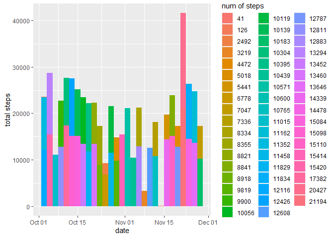
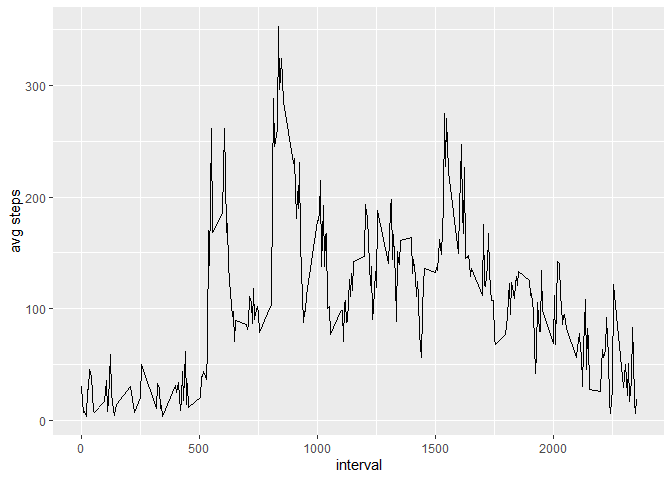
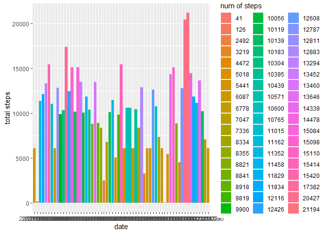
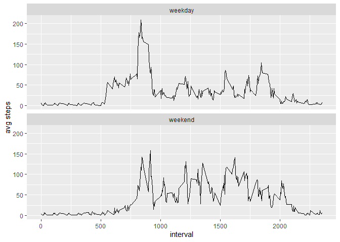

## Activity Monitoring Data Analysis

The data for this assignment can be downloaded from the course web site:

- **Dataset:** Activity monitoring data [52K]
The variables included in this dataset are:

- **steps:** Number of steps taking in a 5-minute interval (missing values are coded as NA)

- **date:** The date on which the measurement was taken in YYYY-MM-DD format

- **interval**: Identifier for the 5-minute interval in which measurement was taken

The dataset is stored in a comma-separated-value (CSV) file and there are a total of 17,568 observations in this dataset.


```r
# Import the data and look at the first six rows
data1 <- read.csv(file = 'activity.csv')
data <- na.omit(data1)
data$date <- as.Date(data$date)
data <- subset(data, steps != 0)
head(data)
```

```
##     steps       date interval
## 555   117 2012-10-02     2210
## 556     9 2012-10-02     2215
## 627     4 2012-10-03      410
## 631    36 2012-10-03      430
## 644    25 2012-10-03      535
## 647    90 2012-10-03      550
```


### What is mean total number of steps taken per day?
For this part of the assignment, you can ignore the missing values in the dataset.

1. Calculate the total number of steps taken per day


```r
totalNumOfSteps <- colSums(data['steps'], na.rm=TRUE)
totalNumOfSteps
```

```
##  steps 
## 570608
```

2. Make a histogram of the total number of steps taken each day


```r
library("ggplot2")
library("scales")
eachDay <- aggregate(steps ~ date, data = data, FUN = sum)

ggplot(eachDay) + 
        geom_histogram(aes(x=date, weight=steps, fill=factor(steps))) +
        ylab("total steps") +
        scale_fill_discrete(name = "num of steps")
```

```
## `stat_bin()` using `bins = 30`. Pick better value with `binwidth`.
```

<!-- -->


3. Calculate and report the mean and median of the total number of steps taken per day


```r
library(doBy)
info <- summaryBy(steps ~ date, data = data, 
                  FUN = list(mean, median, sum), na.rm=TRUE)
info
```

```
##          date steps.mean steps.median steps.sum
## 1  2012-10-02   63.00000         63.0       126
## 2  2012-10-03  140.14815         61.0     11352
## 3  2012-10-04  121.16000         56.5     12116
## 4  2012-10-05  154.58140         66.0     13294
## 5  2012-10-06  145.47170         67.0     15420
## 6  2012-10-07  101.99074         52.5     11015
## 7  2012-10-09  134.85263         48.0     12811
## 8  2012-10-10   95.19231         56.5      9900
## 9  2012-10-11  137.38667         35.0     10304
## 10 2012-10-12  156.59459         46.0     17382
## 11 2012-10-13  119.48077         45.5     12426
## 12 2012-10-14  160.61702         60.5     15098
## 13 2012-10-15  131.67532         54.0     10139
## 14 2012-10-16  157.12500         64.0     15084
## 15 2012-10-17  152.86364         61.5     13452
## 16 2012-10-18  152.36364         52.5     10056
## 17 2012-10-19  127.19355         74.0     11829
## 18 2012-10-20  125.24096         49.0     10395
## 19 2012-10-21   96.93407         48.0      8821
## 20 2012-10-22  154.71264         52.0     13460
## 21 2012-10-23  101.34091         56.0      8918
## 22 2012-10-24  104.43750         51.5      8355
## 23 2012-10-25   56.63636         35.0      2492
## 24 2012-10-26   77.02273         36.5      6778
## 25 2012-10-27  134.92000         72.0     10119
## 26 2012-10-28  110.17308         61.0     11458
## 27 2012-10-29   80.93548         54.5      5018
## 28 2012-10-30  110.32584         40.0      9819
## 29 2012-10-31  179.23256         83.5     15414
## 30 2012-11-02  143.24324         55.5     10600
## 31 2012-11-03  117.45556         59.0     10571
## 32 2012-11-05  141.06757         66.0     10439
## 33 2012-11-06  100.40964         52.0      8334
## 34 2012-11-07  135.61053         58.0     12883
## 35 2012-11-08   61.90385         42.5      3219
## 36 2012-11-11  132.71579         55.0     12608
## 37 2012-11-12  156.01449         42.0     10765
## 38 2012-11-13   90.56790         57.0      7336
## 39 2012-11-15   20.50000         20.5        41
## 40 2012-11-16   89.19672         43.0      5441
## 41 2012-11-17  183.83333         65.5     14339
## 42 2012-11-18  162.47312         80.0     15110
## 43 2012-11-19  117.88000         34.0      8841
## 44 2012-11-20   95.14894         58.0      4472
## 45 2012-11-21  188.04412         55.0     12787
## 46 2012-11-22  177.62609         65.0     20427
## 47 2012-11-23  252.30952        113.0     21194
## 48 2012-11-24  176.56098         65.5     14478
## 49 2012-11-25  140.88095         84.0     11834
## 50 2012-11-26  128.29885         53.0     11162
## 51 2012-11-27  158.67442         57.0     13646
## 52 2012-11-28  212.14583         70.0     10183
## 53 2012-11-29  110.10938         44.5      7047
```

### What is the average daily activity pattern?

1. Make a time series plot (i.e. \color{red}{\verb|type = "l"|}type = "l") of the 5-minute interval (x-axis) and the average number of steps taken, averaged across all days (y-axis)


```r
timeSeries <- aggregate(steps ~ interval , data = data, FUN = mean)

ggplot(timeSeries) + 
        geom_line(aes(x=interval, y=steps)) +
        ylab("avg steps") +
        xlab("interval")
```

<!-- -->

2. Which 5-minute interval, on average across all the days in the dataset, contains the maximum number of steps?


```r
timeSeries[which.max(timeSeries$steps), ]
```

```
##    interval    steps
## 86      835 352.4839
```

### Imputing missing values

1. Calculate and report the total number of missing values in the dataset (i.e. the total number of rows with \color{red}{\verb|NA|}NAs)


```r
colSums(is.na(data1))
```

```
##    steps     date interval 
##     2304        0        0
```

2. Create a new dataset that is equal to the original dataset but with the missing data filled in. Filling in all of the missing values in the dataset with the mean for that 5-minute interval.


```r
idx <- which(is.na(data1$steps))

data1$steps[idx] <- timeSeries$steps[timeSeries$interval==data1$interval]

colSums(is.na(data1))
```

```
##    steps     date interval 
##        0        0        0
```

3. Make a histogram of the total number of steps taken each day and Calculate and report the mean and median total number of steps taken per day. Do these values differ from the estimates from the first part of the assignment? What is the impact of imputing missing data on the estimates of the total daily number of steps?


```r
newInfo <- summaryBy(steps ~ date, data = data1, 
                     FUN = list(mean, median, sum), na.rm=TRUE)
newInfo
```

```
##          date steps.mean steps.median steps.sum
## 1  2012-10-01 21.1354167       22.875      6087
## 2  2012-10-02  0.4375000        0.000       126
## 3  2012-10-03 39.4166667        0.000     11352
## 4  2012-10-04 42.0694444        0.000     12116
## 5  2012-10-05 46.1597222        0.000     13294
## 6  2012-10-06 53.5416667        0.000     15420
## 7  2012-10-07 38.2465278        0.000     11015
## 8  2012-10-08 21.1354167       22.875      6087
## 9  2012-10-09 44.4826389        0.000     12811
## 10 2012-10-10 34.3750000        0.000      9900
## 11 2012-10-11 35.7777778        0.000     10304
## 12 2012-10-12 60.3541667        0.000     17382
## 13 2012-10-13 43.1458333        0.000     12426
## 14 2012-10-14 52.4236111        0.000     15098
## 15 2012-10-15 35.2048611        0.000     10139
## 16 2012-10-16 52.3750000        0.000     15084
## 17 2012-10-17 46.7083333        0.000     13452
## 18 2012-10-18 34.9166667        0.000     10056
## 19 2012-10-19 41.0729167        0.000     11829
## 20 2012-10-20 36.0937500        0.000     10395
## 21 2012-10-21 30.6284722        0.000      8821
## 22 2012-10-22 46.7361111        0.000     13460
## 23 2012-10-23 30.9652778        0.000      8918
## 24 2012-10-24 29.0104167        0.000      8355
## 25 2012-10-25  8.6527778        0.000      2492
## 26 2012-10-26 23.5347222        0.000      6778
## 27 2012-10-27 35.1354167        0.000     10119
## 28 2012-10-28 39.7847222        0.000     11458
## 29 2012-10-29 17.4236111        0.000      5018
## 30 2012-10-30 34.0937500        0.000      9819
## 31 2012-10-31 53.5208333        0.000     15414
## 32 2012-11-01 21.1354167       22.875      6087
## 33 2012-11-02 36.8055556        0.000     10600
## 34 2012-11-03 36.7048611        0.000     10571
## 35 2012-11-04 21.1354167       22.875      6087
## 36 2012-11-05 36.2465278        0.000     10439
## 37 2012-11-06 28.9375000        0.000      8334
## 38 2012-11-07 44.7326389        0.000     12883
## 39 2012-11-08 11.1770833        0.000      3219
## 40 2012-11-09 21.1354167       22.875      6087
## 41 2012-11-10 21.1354167       22.875      6087
## 42 2012-11-11 43.7777778        0.000     12608
## 43 2012-11-12 37.3784722        0.000     10765
## 44 2012-11-13 25.4722222        0.000      7336
## 45 2012-11-14 21.1354167       22.875      6087
## 46 2012-11-15  0.1423611        0.000        41
## 47 2012-11-16 18.8923611        0.000      5441
## 48 2012-11-17 49.7881944        0.000     14339
## 49 2012-11-18 52.4652778        0.000     15110
## 50 2012-11-19 30.6979167        0.000      8841
## 51 2012-11-20 15.5277778        0.000      4472
## 52 2012-11-21 44.3993056        0.000     12787
## 53 2012-11-22 70.9270833        0.000     20427
## 54 2012-11-23 73.5902778        0.000     21194
## 55 2012-11-24 50.2708333        0.000     14478
## 56 2012-11-25 41.0902778        0.000     11834
## 57 2012-11-26 38.7569444        0.000     11162
## 58 2012-11-27 47.3819444        0.000     13646
## 59 2012-11-28 35.3576389        0.000     10183
## 60 2012-11-29 24.4687500        0.000      7047
## 61 2012-11-30 21.1354167       22.875      6087
```


```r
newEachDay <- aggregate(steps ~ date, data = data1, FUN = sum)

ggplot(newEachDay) + 
        geom_histogram(aes(x=date, weight=steps, fill=factor(steps)), stat = "count")         + ylab("total steps") +
        scale_fill_discrete(name = "num of steps")
```

<!-- -->

### Are there differences in activity patterns between weekdays and weekends?

1. Create a new factor variable in the dataset with two levels – “weekday” and “weekend” indicating whether a given date is a weekday or weekend day.


```r
data1$date <- as.Date(data1$date)
data1$week <- ifelse(weekdays(data1$date) %in% c("Saturday", "Sunday"), "weekend", "weekday")
head(data1)
```

```
##      steps       date interval    week
## 1 30.33333 2012-10-01        0 weekday
## 2 18.00000 2012-10-01        5 weekday
## 3  7.00000 2012-10-01       10 weekday
## 4  8.00000 2012-10-01       15 weekday
## 5  4.00000 2012-10-01       20 weekday
## 6 27.75000 2012-10-01       25 weekday
```

2. Make a panel plot containing a time series plot (i.e. \color{red}{\verb|type = "l"|}type = "l") of the 5-minute interval (x-axis) and the average number of steps taken, averaged across all weekday days or weekend days (y-axis). See the README file in the GitHub repository to see an example of what this plot should look like using simulated data.


```r
library(data.table)
newTimeSeries <- data.table(data1)
meanByInterval <- newTimeSeries[, mean(steps), by=list(interval, week)]
meanByInterval
```

```
##      interval    week         V1
##   1:        0 weekday  6.0666667
##   2:        5 weekday  2.8000000
##   3:       10 weekday  1.0888889
##   4:       15 weekday  1.2444444
##   5:       20 weekday  0.6222222
##  ---                            
## 572:     2335 weekend 12.0000000
## 573:     2340 weekend  6.3750000
## 574:     2345 weekend  5.0937500
## 575:     2350 weekend  3.5000000
## 576:     2355 weekend  5.7500000
```

```r
ggplot(meanByInterval) + 
        geom_line(aes(x=interval, y=V1)) +
        ylab("avg steps") +
        xlab("interval") +
        facet_wrap(~ week, ncol=1)
```

<!-- -->
