# Module 3, Summative Assignment: Mongoid and Rails Scaffold

This assignment will evaluate your ability to implement a data tier
using Mongoid and integrate that into a Rails controller and view.

The overall goal of the assignment is to:

  * Implement a model and custom type classes mapped to an existing 
  set of document schemas
  * Implement relationships of differing cardinality, realization, 
  and direction
  * Implement constraints and validations for the data tier
  * Implement queries
  * Implement Web access to the database tier using a MVC thru Rails
  scaffold

The functional goal of the assignment is to:

  * Implement a data tier for triathlon race results
  * Implement a web tier to register for races and view race results.

This assignment requires you to build a functional application with
Mongoid and, in doing so, may require some features used that were not
officially part of the class lectures and earlier formative assignments.
When that occurs, specific URL references into the online documentation, 
extra hints, and descriptions are added as supplemental guidance for the 
assignment step.

The length of the assignment is partially due to the many examples shown
throughout each section and the desire to put together a complete and 
interesting problem. The core of the assignment is within the data tier and 
how to make the web tier easier to implement. Once you reach the web tier, 
much of the code will be provided so that you will have a chance to visualize 
your data and observe how the web tier interacts with your data model. 
The following two images are of races and race results, respectively, and depicts
the data that our application must manage.

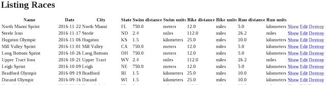

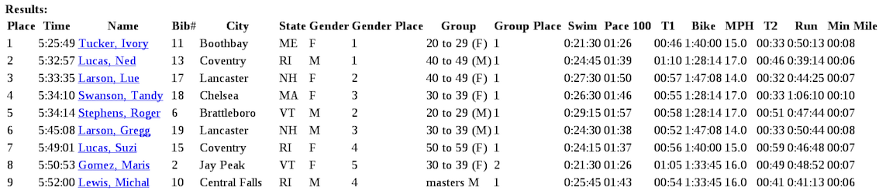

## Functional Requirements

1. Ingest a set of documents.

    * `db/races.json` - contains `Race` documents that represent a specific race
    to occur.
    * `db/racers.json` - contains `Racer` documents that represent a specific
    racer that participates in zero (0) or more races.
    * `db/results.json` - contains `Entrant` documents that represent a specific 
    racer's registration in a race and their results.

	
	[`Data Model`](docs/module3-summative-drawing.jpg)

2. Implement a data tier to process the existing data and manage new information.
The data tier consists of the following custom and document types:

    * Implement three (3) custom types that represent data without any specific
    identity.

        * `Point` - a geographic point for an address
        * `Address` - descriptive information for where something is located
        * `Placing` - a ranked order someone finishes in a race within a category

    * Implement nine (9) model classes plus a base class that represent
    specific information in a triathlon race.
    	
    	* `Racer` - represents a single individual and reference to all race entries.
    	* `RacerInfo` - represents the racer identity required by races he/she enters. The master copy 		is embedded within `Racer`. A copy of this is embedded within his/her `Entrant`, which 		represents the entry within a race.
    	* `Entrant` - represents a single racer's registration in a race and their results,
 		broken down by leg -- to include swim, bike, and run events in addition to 
 		the two transitions between the three events. 
		* `LegResult` - is a base class representing the event results within a race for a specific 		racer. A leg can represent a transition or actual sport events. Sub-classes are supplied to track 		unique information per event. All instances of this class and sub-types are contained within an 		embedded collection within `Entrant`. Instances of this class will also embed copies of the 		`Event` they are a result for.
		* `SwimResult` - is a sub-class of `LegResult` that reports results specific to a swimming event.
		* `BikeResult` - is a sub-class of `LegResult` that reports results specific to a bike event.
		* `RunResult` - is a sub-class of `LegResult` that reports results specific to a running event.
		* `Race` - represents the overall race with its events and entrant information.
		* `RaceRef` - represents race-identifying information that is copied into each `Entrant`. This is 		built from `Entrant` attributes.
		* `Event` - represents a specific event within a race. It has a name (e.g., "Swim", "Bike", or 		"Run") and a distance.
    	
		       
3. Implement an interface facade for the data tier to make access to 
information easier and safer for clients like the web tier. This
will include:

    * building a flat view of nested document attributes without
    changing our nested document structure
    * implementing cross-model service methods to avoid complex
    code from being written in the controller and view classes

4. Implement web page access to `Race` and `Racer` information and
the nested resource `Entrant` that holds the registration and results
associated with them.

    * `Racer`s
        - an index page of all `Racer`s
        - a show page of finishes in each `Race` (via `Entrant`)
    * `Race`s
        - an index page of all Race`s
        - a show page of results for each `Racer` (via `Entrant`)

5. Implement web page access to register for future races.

    * `Racer`s
        - an edit page where `Racer`s can register for upcoming
        `Race`s that have not yet registered for (i.e., create
        an `Entrant`)

## Getting Started

1. Start your MongoDB server using `mongod`.

2. Create a new Rails application called `triresults`.

    ```shell
    $ rails new triresults
    $ cd triresults
    ```
3. Setup your application for Mongoid.

    * Add the `mongoid` gem to your Gemfile and run `bundle`.

    	```ruby
    	gem 'mongoid', '~> 5.0.0'
    	```
    
    * Generate a `mongoid.yml` configuration file.

    	```shell
    	$ rails g mongoid:config		# Rails command to generate mongoid config
    	
    		create config/mongoid.yml	# Output response to the above command
    	```
    
    * Add the generated `mongoid.yml` file to `config/application.rb`

    	```ruby
    	module Triresults
    	  class Application < Rails::Application
    	    ...
    	    # bootstraps mongoid within applications -- like rails console
    	    Mongoid.load!('./config/mongoid.yml')
    		...
    	   end
    	end
    	```

4. Use the `rails console` during your development to invoke your solutions
for the data tier. Adding the optional `test` after the `rails console` command
will open the console using the test database instead of your development database.  
Remember to reload after making changes to your source code.

    ```ruby
    $ rails c 
    > ...
    > reload!
    > ...
    ```

5. Download and extract the starter set of boostrap files for this assignment. 

    ```shell
    student-start/
    |-- Gemfile
    |-- db
    |   |-- races.json
    |   |-- racers.json
    |   `-- results.json
    |-- lib
    |   `-- tasks
    |       `-- assignment.rake
    |-- .rspec (an important hidden file)
    `-- spec
        |-- ..._spec.rb
        |-- ..._spec.rb
        `-- data
        	  |-- races.json
        	  |-- racers.json
        	  `-- results.json
    ```

    * Overwrite your existing Gemfile with the Gemfile from the bootstrap fileset. 
    They should be nearly identical, but this is done to make sure the gems and 
    versions you use in your solution can be processed by the automated Grader 
    when you submit. Any submission should be tested with this version of the file.

        **NOTE** the Gemfile includes a section added for testing.

        ```ruby
        group :test do
            gem 'rspec-rails', '~> 3.0'
            gem 'mongoid-rspec', '3.0.0'
            gem 'capybara'
        end
        ```

        as well as a new definition for the following items:

        - `tzinfo-data` gem conditionally included on Windows platforms
        - `mongoid` gem 

        ```ruby
        # Windows does not include zoneinfo files, so bundle the tzinfo-data gem
        gem 'tzinfo-data', platforms: [:mingw, :mswin, :x64_mingw, :jruby]
        gem 'mongoid', '~> 5.0.0'
        ```

    * Add the provided json data files to your `db/` directory.

    * Add the provided rake assignment task to the `lib/tasks` directory
    in your `triresults` application.  This file contains the rake task
    used by the tests to initialize the database prior to running the
    tests that determine if you have completed the assignment.

    * Add the `spec/*.rb` files provided with the bootstrap fileset to a
    corresponding  `spec/` directory within your `triresults` application. 
    These files contain tests that will help determine whether you have 
    completed the assignment. Furthermore, copy the `spec/data/*.json` files
    over to a corresponding `spec/data/` directory within `triresults` as well.
    These are internal data files that rspec will use to execute its tests.
    Lastly, be sure to also copy the hidden `.rspec`file in the root directory. 

6. Run the `bundle` command to make sure all gems are available.

    ```shell
    $ bundle
    ```

7. Ingest the sample data. This data will assist you as you build and
test your solution. The data is time-sensitive, so repeat as necessary
to continue to have upcoming races in the future.

    ```shell
    $ rake assignment:setup_data

    importing data...
    races=144, racers=1000, results=2880
    updating database: triresults_development
    updating race dates to current by (N) years
    updating birth years to current by (N) years
    updating creation and update times to (today)
    ```

    **Note** that the data ingested into the development database is not
    used for grading. The tests will generate new data in the test
    database. You can refresh your development database by repeating
    the above commands if you delete or insert data you wish to remove.

8. Run the rspec test(s) to receive feedback. `rspec` must be run from the
root directory of your application.  There are several test files provided
for this assignment. Many of those files are designed to test your code
at specific points as you proceed through the technical requirements
of this assignment.  Initially, majority of tests will (obviously)
fail until you complete the requirements necessary for them to pass.

    ```shell
    $ rspec 
    ...
    (N) examples, (N) failures, (N) pending
    ```

    To focus test feedback on a specific step of the requirements, add the specific
    file (path included) with the tests along with "-e rq##" to the rspec command 
    line to only evaluate a specific requirement. Pad all step numbers to two 
    digits.

    ```shell
    $ rspec spec/railscheck_spec.rb -e rq00
    ...
    (N) examples, (N) failures, (N) pending
    ```

9. Implement your solution to the technical requirements and use the rspec tests 
to help verify your completed solution.

10. Submit your Rails app solution for grading.

## Technical Requirements

### Implement Custom Types

In this section you must implement three custom types; `Point`, `Address`,
and `Placing`.  

 

[`Custom Types`](docs/rsz_custom_types.png)

Custom types are groupings of fields that occur within
a document that do not have on ID. There are no
`rails g` templates for creating custom classes but store them in the
`apps/models` directory in separate files that follow the
`snake_case.rb` file naming conventions. For each of these custom types,
you must:

  * implement an instance method called `mongoize` that accepts no arguments and 
  marshals the state of the instance into MongoDB format as a Ruby hash.
  **Hint**:

    ```ruby
    def mongoize
      return { ... }
    end 
    ```

  * implement a class method called `mongoize` that accepts a single
  argument of at least three (3) forms -- nil, class instance, and
  database hash -- and returns the state marshalled into MongoDB
  format as a Ruby hash (if appropriate). **Hint**:

    ```ruby
    def self.mongoize object
      case object
      when nil then ...
      when Hash then ...
      when (ModelClass) then ...
      end 
    end 
    ```

  * implement a class method called `demongoize` that accepts a
  single argument of at least three (3) forms -- nil, class instance,
  and database hash form -- and returns an instance of the class
  (if appropriate). **Hint**:

    ```ruby
    def self.demongoize object
      case object
      when nil then ...
      when Hash then ...
      when (ModelClass) then ...
      end 
    end 
    ```

  * implement a class method called `evolve` that functionally behaves the same as the 
  `mongoize` class method.


1. Implement a custom type called `Point` to handle processing the `GeoJSON Point`
format within the ingested JSON data. This class must:

    * provide read/write access to a `longitude` field
    * provide read/write access to a `latitude` field
    * produce a MongoDB format consistent with the following:
    
	    ```ruby
	    {:type=>"Point", :coordinates=>[(longitude), (latitude)]}
	    ```
    * gracefully handle nil inputs, initializing internals to nil or returning
    nil where appropriate

    You can demonstrate your custom type using the rails console.
    The following demonstrates demarshalling the MongoDB hash format into 
    an object instance that can report longitude and latitude values.

    ```ruby
    > point=Point.demongoize(:type=>"Point", :coordinates=>[-122.27,37.80])
     => #<Point:0x00000005696540 @longitude=-122.27, @latitude=37.8> 
    > point.longitude
     => -122.27 
    > point.latitude
     => 37.8 
    ```

    The following demonstrates marshalling the object instance and hash
    back out as a MongoDB hash -- ready for storage.

    ```ruby
    > point.mongoize
     => {:type=>"Point", :coordinates=>[-122.27, 37.8]} 
    > Point.mongoize(point)
     => {:type=>"Point", :coordinates=>[-122.27, 37.8]} 
    > Point.mongoize(:type=>"Point", :coordinates=>[-122.27,37.80])
     => {:type=>"Point", :coordinates=>[-122.27, 37.8]}
    ```

    The following is an example of being called with nil data. A nil is
    returned, but could have been an empty point. We will not be entering
    this information at the UI, so we do not need any automatic build 
    behavior.

    ```ruby
    > Point.demongoize(nil)
     => nil 
    ```

    ```shell
    $ rspec spec/custom_types_spec.rb -e rq01
    ```

2. Implement a custom type called `Address` to handle processing the address
format within the ingested JSON data. This class must:

    * provide read/write access to a `city` field of type String mapped to the document 
    key of `city`
    * provide read/write access to a `state` field of type String mapped to the document 
    key of `state`
    * provide read/write access to a `location` field of type `Point` mapped to the document 
    key of `loc`
    * produce a MongoDB format consistent with the following:
    
	    ```ruby
	    {:city=>"(city)", :state=>"(state)", :loc=>(point)}
	    ```
    
    * gracefully handle nil inputs, initializing internals to nil or returning
    nil where appropriate

    **Note** that this custom class is embedding a second custom class. Each of its `mongoize` and 
    `demongoize` calls must delegate the commands to the embedded class to complete that area
    of the document.

    You can demonstrate your custom type using the rails console.
    The following demonstrates demarshalling the MongoDB hash format into 
    an object instance that can report all document fields as attributes.

    ```ruby
    > address=Address.demongoize(:city=>"Oakland", :state=>"CA", 
         :loc=>{:type=>"Point", :coordinates=>[-122.27, 37.8]})
     => #<Address:0x00000004be7c48 @city="Oakland", @state="CA", 
         @location=#<Point:0x00000004be97a0 @longitude=-122.27, @latitude=37.8>> 
    > address.city
     => "Oakland" 
    > address.state
     => "CA" 
    > address.location.longitude
     => -122.27 
    > address.location.latitude
     => 37.8 
    ```

    The following demonstrates marshalling the object instance and hash
    back out as a MongoDB hash -- ready for storage.

    ```ruby
    > address.mongoize
     => {:city=>"Oakland", :state=>"CA", :loc=>{:type=>"Point", :coordinates=>[-122.27, 37.8]}} 
    > Address.mongoize(address)
     => {:city=>"Oakland", :state=>"CA", :loc=>{:type=>"Point", :coordinates=>[-122.27, 37.8]}} 
    > Address.mongoize(:city=>"Oakland", :state=>"CA", 
          :loc=>{:type=>"Point", :coordinates=>[-122.27, 37.8]})
     => {:city=>"Oakland", :state=>"CA", :loc=>{:type=>"Point", :coordinates=>[-122.27, 37.8]}} 
    ```

    The following is an example of being called with nil data. A nil is returned.

    ```ruby
    > Address.demongoize(nil)
     => nil
    ```

    ```shell
    $ rspec spec/custom_types_spec.rb -e rq02
    ```

3. Implement a custom type called `Placing` to handle processing the placing
format within the ingested JSON data. This class must:

    * provide read/write access to a `name` field of type String mapped to the document key of `name`
    * provide read/write access to a `place` field of type Integer mapped to the document key of `place`
    * produce a MongoDB format consistent with the following format:
    
	    ```ruby
	    {:name=>"(category name)" :place=>"(ordinal placing)"}
	    ```
    
    * gracefully handle nil inputs, initializing internals to nil or returning
    nil where appropriate

    You can demonstrate your custom type using the rails console.
    The following demonstrates demarshalling the MongoDB hash format into 
    an object instance that can report all document fields as attributes.

    ```ruby
    > group_placing=Placing.demongoize(:name=>"masters", :place=>3)
     => #<Placing:0x00000004e02910 @name="masters", @place=3> 
    > group_placing.name
     => "masters" 
    > group_placing.place
     => 3 
    ```

    The following demonstrates marshalling the object instance and hash
    back out as a MongoDB hash -- ready for storage.

    ```ruby
    > group_placing.mongoize
     => {:name=>"masters", :place=>3} 
    > Placing.mongoize(group_placing)
     => {:name=>"masters", :place=>3} 
    > Placing.mongoize(:name=>"masters", :place=>3)
     => {:name=>"masters", :place=>3} 
    ```

    The following is an example of being called with nil data. A nil is returned.

    ```ruby
    > Placing.demongoize nil
     => nil 
    ```

    ```shell
    $ rspec spec/custom_types_spec.rb -e rq03
    ```

### Implement `racers` Collection

This section concentrates on implementing the core of the `racers`
collection, which consists of two model classes: `Racer` and `RacerInfo`.

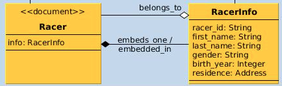

[Racer Collection](docs/rsz_racers_collection.png)

`RacerInfo` holds the core `Racer` information used to register for races. 
`Racer` embeds the `RacerInfo` and will
hold relationships and information that may not be appropriate to store
in an entrant registration. 

`RacerInfo` makes use of the `Address` and `Point` custom types. 
(Recall that `Address` uses a `location` attribute of type `Point`) 
`RacerInfo` must be implemented as an embedded class in such a way that it 
can be stored within `Racer` (the "master" copy) and `Entrant` (for each race). 
Relationships involving not yet implemented classes (e.g., `Entrant`) 
will be added later.

1. Implement a Mongoid model class called `RacerInfo` (**Hint**: `rails g model`)
to act as the core information to identify the racer and to register for races.

    * have a field called `first_name` of type String and mapped to the document key of `fn`
    * have a field called `last_name` of type String and mapped to the document key of `ln`
    * have a field called `gender` of type String and mapped to the document key of `g`
    * have a field called `birth_year` of type Integer and mapped to the document key of `yr`
    * have a field called `residence` of custom type `Address` and mapped to the document key `res`
    * declare its `_id` field to be mapped to the document key `racer_id` and
    have its default value set to the value of `racer_id`. Declare the field 
    as untyped so that whatever `_id` type is in the `Racer` can be stored in 
    this field. The intent here is to have the id field stored in the document
    as `racer_id` and not have a duplicate `_id`. We may succeed. We may fail,
    but give it a try. **Hint**: One mechanism to do this is the following:
    
	    ```ruby
	      field :racer_id, as: :_id
	      field :_id, default:->{ racer_id }
	    ```

    You can demonstrate your model class using the rails console. The following
    example shows a `RacerInfo` being built (but not saved) with all attributes being set,
    including a nested set of custom type classes for `Address` and `Point`.
    **Note** that the instance supports both model attribute names and document keys.
    The document produced uses the document key values when saving.

    ```ruby
    > point=Point.demongoize(:type=>"Point", :coordinates=>[-122.27, 37.8])
    > address=Address.demongoize(:city=>"Oakland", :state=>"CA", :loc=>point.mongoize)
    > RacerInfo.new(id:"000", fn:"cat", ln:"inhat", g:"M", yr:1940, res:address)
    Overwriting existing field _id in class RacerInfo.
     => #<RacerInfo _id: 000, racer_id(_id): "000", 
       fn(first_name): "cat", ln(last_name): "inhat", g(gender): "M", yr(birth_year): 1940, 
       res(residence): {:city=>"Oakland", :state=>"CA", 
                        :loc=>{:type=>"Point", :coordinates=>[-122.27, 37.8]}}> 
    ```

    ```shell
    $ rspec spec/racers_spec.rb -e rq01
    ```

2. Implement a Mongoid model class called `Racer` (**Hint**: `rails g model`)
to act as the root-level document in the `racers` collection ingested in
the initial section. This class must:

    * (have no fields at this point)

    You can demonstrate your new model class using the rails console. The
    following just shows the hollow class we have at this point.

    ```ruby
    > Racer.new.attributes
     => {"_id"=>BSON::ObjectId('568061efe301d07bcf000001')}
    ```

    ```shell
    $ rspec spec/racers_spec.rb -e rq02
    ```

3. Implement the polymorphic, 1:1 embedded relationship between `Racer` and `RacerInfo`.
This is made to be polymorphic so that clones of `RacerInfo` can be can be embedded in 
both the `Racer` and `Entrant` model classes.  In the `RacerInfo` class, you must:

    * name the `embedded_in` relationship `parent`
    * define the `embedded_in` relationship as polymorphic

    In the `Racer` class, you must:

    * name the `embeds_one` relationship `info` (**Hint**: You will need to 
    define a `class_name` mapping since `info` and `RacerInfo` are not consistent
    with one another)
    * define the `embeds_one` relationship as `autobuild: true` to 
    automatically create the object when the relationship is navigated.
    * define the `embeds_one` relationship polymorphic type as `parent`
    * implement a `before_create` callback to assign the local `id` primary
    key to the `info.id` property. **Hint**:
    
    ```ruby
    before_create do |racer|
      racer.info.id = racer.id
    end
    ```

    You can demonstrate your new embedded relationship using the rails console.
    The following example shows the hollow `Racer` and `RacerInfo` being created
    and the `_id` of the `Racer` stored as `racer_id` in the `RacerInfo`. The
    `RacerInfo` object was created using the `autobuild` option during the 
    `before_create` callback when the assignment was made.

    ```ruby
    > r=Racer.create
     => #<Racer _id: 56806b4de301d07bcf00000c, > 
    > Racer.collection.find(:_id=>r.id).first
     => {"_id"=>BSON::ObjectId('56806b4de301d07bcf00000c'), 
         "info"=>{"racer_id"=>"56806b4de301d07bcf00000c"}}
    ```

    The following demonstrates building an in-memory compound document for the `Racer`
    with `RacerInfo`, `Address`, and geolocation `Point` and then saving. The 
    collection-level database query shows the embedded document and the 
    assignment of `Racer`._id to `RacerInfo.racer_id`.

    ```ruby
    > point=Point.demongoize(:type=>"Point", :coordinates=>[-122.27, 37.8])
    > address=Address.demongoize(:city=>"Oakland", :state=>"CA", :loc=>point.mongoize)
    > racer=Racer.new
    > racer.build_info(fn:"cat", ln:"inhat", g:"M", yr:1940, res:address)
    Overwriting existing field _id in class RacerInfo.
    > racer.save
    > pp Racer.collection.find(:_id=>racer.id).first
    {"_id"=>BSON::ObjectId('568070e3e301d07bcf000012'),
     "info"=>
      {"fn"=>"cat",
       "ln"=>"inhat",
       "g"=>"M",
       "yr"=>1940,
       "res"=>
        {"city"=>"Oakland",
         "state"=>"CA",
         "loc"=>{"type"=>"Point", "coordinates"=>[-122.27, 37.8]}},
       "racer_id"=>BSON::ObjectId('568070e3e301d07bcf000012')}}
    ```
    

    ```shell
    $ rspec spec/racers_spec.rb -e rq03
    ```

4. Implement [field validation](http://guides.rubyonrails.org/v3.2.13/active_record_validations_callbacks.html)
for the `RacerInfo` that:

    * validates `first_name` is present
    * validates `last_name` is present
    * validates `gender_name` is present and has values `M` or `F`
    * validates `birth_year` is present and has value in the past

    **Hint**: `:inclusion` and `:numericality`

    You can demonstrate your validations using the rails console. In this
    first example, we have provided no values for any of the fields.
    Note that our example shows some custom error text for `gender`
    having the wrong value and `birth_year` not being in the past.
    You are not required to provide any specific custom text in your
    validations.

    ```ruby
    > info=RacerInfo.new
    > info.validate
     => false 
    > pp info.errors.messages
    {:first_name=>["can't be blank"],
     :last_name=>["can't be blank"],
     :gender=>["can't be blank", "must be M or F"],
     :birth_year=>["can't be blank", "must in past"]}
    ```

    In the next example, we supply invalid values for `gender` and `birth_year`.
    Notice we do not get errors for `gender` and `birth_year` not being supplied,
    but we do get errors for the invalid values they contain.

    ```ruby
    > info=RacerInfo.new(g:"X", yr:2100)
    > info.validate
     => false 
    > pp info.errors.messages
    {:first_name=>["can't be blank"],
     :last_name=>["can't be blank"],
     :gender=>["must be M or F"],
     :birth_year=>["must in past"]}
    ```

    In the next example, we show how a `Racer` with no `RacerInfo` is valid
    but a `Racer` with an empty `RacerInfo` is not valid.

    ```ruby
    > racer=Racer.new
     => #<Racer _id: 56807554e301d07bcf000017, > 
    > racer.validate
     => true 
    > info=racer.info
     => #<RacerInfo _id: , racer_id(_id): nil, fn(first_name): nil, ln(last_name): nil, 
        g(gender): nil, yr(birth_year): nil, res(residence): nil> 
    > racer.validate
     => false 
    > racer.errors.messages
     => {:info=>["is invalid"]} 
    ```

    In the last example, we supply valid values for all fields.

    ```ruby
    > info=RacerInfo.new(fn:"cat", ln:"inhat", g:"M", yr:1940)
    > info.validate
     => true 
    > pp info.errors.messages
    {}
    ```

    ```shell
    $ rspec spec/racers_spec.rb -e rq04
    ```

### Implement `races` Collection

This section concentrates on implementing the core of the `races` collection,
which consists of `Race` and an embedded class `Event`. 

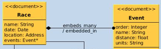

[Races Collection](docs/rsz_races_collection.png)

Relationships involving not yet implemented classes (e.g., `Entrant`) will be added later.

1. Implement a Mongoid model class called `Race` (**Hint**: `rails g model`)
to act as the root-level document in the `races` collection ingested in
the initial section. This class must:

    * be defined to track timestamps using the `created_at` and `updated_at` document keys
    * have a field called `name` of type String and mapped to the document key of `n`
    * have a field called `date` of type Date and mapped to the document key of `date`
    * have a field called `location` of type Address and mapped to the document key of `loc`

    You can demonstrate your new model class using the rails console.
    In this example we first build a transient instance and then save to 
    the database. After that we use the create() option to automatically
    save the document to the database. Notice the `created_at` and `updated_at`
    timestamps in the database. These were automatically generated when the 
    model was saved.

    ```ruby
    > point=Point.demongoize(:type=>"Point", :coordinates=>[-122.27, 37.8])
    > address=Address.demongoize(:city=>"Oakland", :state=>"CA", :loc=>point.mongoize)
    > race=Race.new(name:"Oakland 10K", date:Date.current, location:address)
    > race.save
    > race=Race.create(n:"Oakland 10K", date:Date.current, loc:address)
    > pp Race.find(race.id).attributes
    {"_id"=>BSON::ObjectId('5677a506e301d0e5e2000018'),
     "n"=>"Oakland 10K",
     "date"=>2015-12-21 00:00:00 UTC,
     "loc"=>
      {"city"=>"Oakland",
       "state"=>"CA",
       "loc"=>{"type"=>"Point", "coordinates"=>[-122.27, 37.8]}},
     "updated_at"=>2015-12-21 07:06:46 UTC,
     "created_at"=>2015-12-21 07:06:46 UTC}
    ```

    ```shell
    $ rspec spec/races_spec.rb -e rq01
    ```

2. Implement a Mongoid model class called `Event` (**Hint**: `rails g model`) 
to be embedded within `Race` and `LegResult` model classes using a polymorhic
`embedded_in` relationship. This class must

    * have a field called `order` of type Integer and mapped to the document key of `o`
    * have a field called `name` of type String and mapped to the document key of `n`
    * have a field called `distance` of type float and mapped to the document key of `d`
    * have a field called `units` of type String and mapped to the document key of `u`
    * have an instance method called `meters` that will return the length of the course in meters
    * have an instance method called `miles` that will return the length of the course in miles

    **Hint**: There are
    
    * 1 meter = 0.000621371 miles
    * 1 kilometer = 0.621371 miles
    * 1 yard = 0.000568182 miles
    * 1 yard = 0.9144 meters
    * 1 mile = 1609.344 meters
    * 1 mile = 1.609344 kilometers

    You can demonstrate the new model class using the rails console. In
    this example we are creating a default instance of the class and
    the built-in debug for a class instance shows the field names we
    have and their mappings to the document.

    ```ruby
    > Event.new
     => #<Event _id: 5677a72ce301d0e5e2000019, 
       o(order): nil, n(name): nil, d(distance): nil, u(units): nil>
    ```

    In the next example, we demonstrate the conversion from miles to 
    meters, meters to meters, and error cases that return nil when 
    there is missing information.

    ```ruby
    > Event.new(d:0.000621371*10, u:"miles").meters
      => 9.99999690624
    > Event.new(d:10, u:"meters").meters
     => 10.0 
    > Event.new(d:10).meters
     => nil 
    > Event.new(u:"meters").meters
     => nil 
    ```

    In the following we are demonstrating the conversion from meters 
    to miles.

    ```ruby
     > Event.new(d:1609.344, u:"meters").miles
      => 0.9999996906240001
    ```

    ```shell
    $ rspec spec/races_spec.rb -e rq02
    ```

3. Implement the polymorphic, M:1 embedded relationship between `Event` and `Race`.
In the `Event` class, you must:

    * name the `embedded_in` relationship `parent`
    * define the `embedded_in` relationship as polymorphic
    * define the `embedded_in` relationship such that the parent's timestamp
    is updated whenever the child document is changed. **Hint**:
    
    ```ruby
    touch: true
    ```

    In the `Race` class, you must:

    * name the `embeds_many` relationship `events`
    * define the `embeds_many` relationship polymorphic type as `parent`
    * define the `embeds_many` with a default ASCENDING sort order based
    on the `order` field. **Hint**: This is not covered in the online documentation, 
    but can be accomplished by adding the following array property to the relationship.
    
    ```ruby
    order: [:order.asc]
    ```

    You can demonstrate your embedded relationship using the rails console.
    In this example we build the five (5) stages of a triathlon to include
    the two transition segments. The events are saved within an array within 
    the `Racer` instance.

    ```ruby
    > race=Race.find_by(n:"Oakland 10K")
    > race.events.build(o:0, n:"swim", d:1, u:"miles") 
    > race.events.build(o:1, n:"t1")                   
    > race.events.build(o:2, n:"bike", d:25, u:"miles") 
    > race.events.build(o:3, n:"t2")
    > race.events.build(o:4, n:"run", d:10, u:"kilometers") 
    > race.save
    > pp Race.find(race.id).attributes
    {"_id"=>BSON::ObjectId('5677a506e301d0e5e2000018'),
     "n"=>"Oakland 10K",
     "date"=>2015-12-21 00:00:00 UTC,
     "loc"=>
      {"city"=>"Oakland",
       "state"=>"CA",
       "loc"=>{"type"=>"Point", "coordinates"=>[-122.27, 37.8]}},
     "updated_at"=>2015-12-21 07:41:00 UTC,
     "created_at"=>2015-12-21 07:06:46 UTC,
     "events"=>
      [{"_id"=>BSON::ObjectId('5677acace301d0e5e2000025'),
        "o"=>0,
        "n"=>"swim",
        "d"=>1.0,
        "u"=>"miles"},
       {"_id"=>BSON::ObjectId('5677acb5e301d0e5e2000026'), "o"=>1, "n"=>"t1"},
       {"_id"=>BSON::ObjectId('5677accee301d0e5e2000027'),
        "o"=>2,
        "n"=>"bike",
        "d"=>25.0,
        "u"=>"miles"},
       {"_id"=>BSON::ObjectId('5677acdfe301d0e5e2000028'), "o"=>3, "n"=>"t2"},
       {"_id"=>BSON::ObjectId('5677acf2e301d0e5e200002a'),
        "o"=>4,
        "n"=>"run",
        "d"=>10.0,
        "u"=>"kilometers"}]}
    ```

    In the next example, we change the sort order with a runtime
    expression.

    ```ruby
    > race.events.order_by(:order.desc).skip(1).limit(3).each {|r| p r}; nil
    #<Event _id: 5677acdfe301d0e5e2000028, o(order): 3, n(name): "t2", d(distance): nil, u(units): nil>
    #<Event _id: 5677accee301d0e5e2000027, o(order): 2, n(name): "bike", d(distance): 25.0, u(units): "miles">
    #<Event _id: 5677acb5e301d0e5e2000026, o(order): 1, n(name): "t1", d(distance): nil, u(units): nil>
    ```

    In the next part of the example, we can test the navigation from the 
    embedded class to the containing parent class thru the polymorphic
    `parent` reference in the embedded class.

    ```ruby
    > race.events.first.parent.name
     => "Oakland 10K"
    ```

    ```shell
    $ rspec spec/races_spec.rb -e rq03
    ```

4. Implement `field validation` for the `Event` that:

    * validates `order` is present
    * validates `name` is present

    You can demonstrate your new validation using the rails console. In the 
    following example, we show that an empty Event is not valid and reports
    specific error messages about the valid fields.

    ```ruby
    > event=Event.new
    > event.validate
     => false 
    > event.errors.messages
     => {:order=>["can't be blank"], :name=>["can't be blank"]}
    ```

    In the following example, we show that the `Race` is considered
    invalid if it has an invalid `Event`.

    ```ruby
    > race=Race.new
    > event=race.events.build
    > race.validate
     => false 
    > race.errors.messages
     => {:events=>["is invalid"]} 
    ```

    Notice that Mongoid refuses to save the `Race` in the invalid state.

    ```ruby
    > race.save
     => false 
    ```

    If we start by creating the `Race` in the database in a valid state, 
    Mongoid refuses to change it to an invalid state by inserting an empty
    `Event.

    ```ruby
    > race=Race.create
    > event=race.events.create
    > Race.where(:id=>race.id).first.attributes
     => {"_id"=>BSON::ObjectId('56872a7fe301d0bcf8000016'), 
      "updated_at"=>2016-01-02 01:40:15 UTC, 
      "created_at"=>2016-01-02 01:40:15 UTC} 
    ```

    If we instead insert a valid `Event`, the update is made to the `Race`.
    One unrelated but interesting thing to note is that Mongoid does not 
    update the parent's `updated_at` timestamp by default, when modifying 
    embedded children. The child relationship must define `touch: true` for
    that to occur.

    ```ruby
    > event=race.events.create(o:0,n:"swim")
    > pp Race.where(:id=>race.id).first.attributes
    {"_id"=>BSON::ObjectId('56872a7fe301d0bcf8000016'),
     "updated_at"=>2016-01-02 01:40:15 UTC,
     "created_at"=>2016-01-02 01:40:15 UTC,
     "events"=>
      [{"_id"=>BSON::ObjectId('56872c5ee301d0bcf8000018'), "o"=>0, "n"=>"swim"}]}
    ```

    ```shell
    $ rspec spec/races_spec.rb -e rq04
    ```

5. Implement a [`named scope`](https://docs.mongodb.org/ecosystem/tutorial/mongoid-queries/#named-scopes)
in the `Race` class called by `upcoming` and `past` that returns a chainable
criteria for races that have not completed and have occured in the past. These 
scopes must:

    * return a chainable Mongoid query criteria set to return matching `Races`
    based on the `:date` property
      - `upcoming` races have dates greater than or equal to today's date
      - `past` races have dates less than today's date


    You can use the Rails console to demonstrate you new named scopes.
    In the example, below, we create three (3) races in the past, present,
    and future.

    ```ruby
    > Race.create(:name=>"Yesterday's Challenge",:date=>Date.yesterday)
    > Race.create(:name=>"Today's Challenge",:date=>Date.current)
    > Race.create(:name=>"Tomorrow's Challenge",:date=>Date.tomorrow)
    ```

    When we request the `past` scope, we get only the races that have occured
    prior to today. In the example, we have also showed criteria chaining
    where we combine a criteria about the name of the race with the criteria
    returned from the scope.

    ```ruby
    > pp Race.past.where(:name=>{:$regex=>"Challenge"}).first.attributes
    D | {"find"=>"races", "filter"=>{"date"=>{"$lt"=>2016-01-27 00:00:00 UTC},
    "n"=>{"$regex"=>"Challenge"}}, "limit"=>-1}
    {"_id"=>BSON::ObjectId('5698fd86e301d000ef00001b'),
     "next_bib"=>0,
     "n"=>"Yesterday's Challenge",
     "date"=>2016-01-14 00:00:00 UTC,
     "updated_at"=>2016-01-15 14:09:10 UTC,
     "created_at"=>2016-01-15 14:09:10 UTC}
    ```

    In the example using `upcoming`, we add `pluck` to the chain so that we 
    request only the attributes we need from the database and Mongoid adds a 
    `projection` to the MongoDB query.

    ```
    > pp Race.upcoming.where(:name=>{:$regex=>"Challenge"}).pluck(:name, :date)
    D | {"find"=>"races", "filter"=>{"date"=>{"$gte"=>2016-01-15 00:00:00 UTC}, 
         "n"=>{:$regex=>"Challenge"}}, "projection"=>{"n"=>1, "date"=>1}}
    [["Today's Challenge", 2016-01-15 00:00:00 UTC],
    ["Tomorrow's Challenge", 2016-01-16 00:00:00 UTC]]
    ```

    ```shell
    $ rspec spec/races_spec.rb -e rq05
    ```

### Implement `results` Collection

This section concentrates on implementing the core of the `results` collection,
which consists of `Entrant`, the embedded class `LegResult` and its sub-classes ...

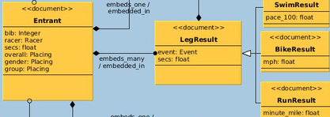

[Results Collection](docs/rsz_results_collection.png)

... as well as the embedded classes (`RacerInfo` and `Event`) from the other two collections.
We will complete the relationships with the other collections in a follow-on section.

1. Implement a Mongoid model class called `Entrant` (**Hint**: `rails g model`)
to act as the root-level document in the `results` collection ingested in
the initial section. This class must:

    * be defined to be stored in the `results` collection
    * be defined to track timestamps using the `created_at` and `updated_at` document keys
    * have a field called `bib` of type Integer and mapped to the document key of `bib`
    * have a field called `secs` of type Float and mapped to the document key of `secs`
    * have a field called `overall` of type Placing and mapped to the document key of `o`
    * have a field called `gender` of type `Placing` and mapped to the document key of `gender`
    * have a field called `group` of type `Placing` and mapped to the document key of `group`

    You can demonstrate your new model class using the rails console. **Note** that 
    because the collection and model class do no share a common base name, we 
    must manually map the class to the `results` collection.

    ```ruby
    > Entrant.collection.name
     => "results"
    ```

    In the example below we create an instance of the `Entrant`, filling 
    in extra details with custom type `Placing` for  `overall`, `gender`, and `group`. 
    You can use whatever initializer to create `Placing`. We are only showing the 
    use of the `demongoize` method since the initializer is not an assignment requirement
    but `demongoize` is a requirement.

    ```ruby
    > entrant=Entrant.new(:bib=>0,:secs=>100.123)
    > entrant.overall=Placing.demongoize(:place=>10)
    > entrant.gender=Placing.demongoize(:name=>"M", :place=>8)
    > entrant.group=Placing.demongoize(:name=>"masters", :place=>5)
    > entrant.save
    > pp Entrant.find(entrant.id).attributes
    {"_id"=>BSON::ObjectId('5678cec8e301d0e5e2000031'),
     "bib"=>0,
     "secs"=>100.123,
     "o"=>{"place"=>10},
     "gender"=>{"name"=>"M", "place"=>8},
     "group"=>{"name"=>"masters", "place"=>5},
     "updated_at"=>2015-12-22 04:18:40 UTC,
     "created_at"=>2015-12-22 04:18:40 UTC}
    ```

    You can verify the `Placings` can be demarshaled into an instance by reading
    out specific properties of each.

    ```ruby
    > Entrant.find(entrant.id).group.name
     => "masters"
    > Entrant.find(entrant.id).gender.place
     => 8 
    ```

    ```shell
    $ rspec spec/results_spec.rb -e rq01
    ```

2. Implement a Mongoid model class called `LegResult` (**Hint**: `rails g model`) 
to act as the base class for individual event leg results and the implementation class
for the two transition results in between the three events. This class must:

    * have a field called `secs` of type Float and mapped to the document key of `secs`
    * have an empty callback method called `calc_ave`. This will be used by sub-classes
    to update their event-specific average(s) based on the details of the `event` and the 
    time to complete in `secs`
    * have an `after_initialize` [callback](https://docs.mongodb.org/ecosystem/tutorial/mongoid-callbacks/#document-callbacks)
     method defined to invoke `calc_ave`
    * override the `secs=` method such that it calls `calc_ave` to refresh average(s)
    calculated after it has manually updated `self[:secs]` with the provided value.

    **Hint**:
    
    ```ruby
    def calc_ave
      #subclasses will calc event-specific ave
    end
    after_initialize do |doc|
      #...
    end
    def secs= value
      #...
    end
    ```

    You can demonstrate your new model class using the rails console. In the following
    example we are creating a default instance.

    ```ruby
    > LegResult.new
     => #<LegResult _id: 569da237e301d0fa6b00001d, secs: nil> 
    > result=LegResult.new(:secs=>60)
     => #<LegResult _id: 569da2a5e301d0fa6b00001f, secs: 60.0> 
    > result.secs=120
    > result
     => #<LegResult _id: 569da2a5e301d0fa6b00001f, secs: 120.0> 
    ```

    ```shell
    $ rspec spec/results_spec.rb -e rq02
    ```

3. Implement the concrete, M:1 embedded relationship between `LegResult` and `Entrant`.
In the `LegResult` class, you must:

    * name the `embedded_in` relationship `entrant`

    In the `Entrant` class, you must:

    * name the `embeds_many` relationship `results`
    * map  the `embeds_many` relationship to the base class `LegResult`
    (**Hint**: because of the difference in names, you must map the `class_name`
    for the collection to the proper classname stored in the collection)
    
    You can demonstrate your new relationship using the rails console. In the 
    following example, we create a new, in-memory, anonymous `Entrant` and 
    associate one `LegResult`. The object tree is not yet saved because 
    we need to add some additional properties in a follow-on step to 
    make `LegResult` complete.

    ```ruby
    > entrant=Entrant.new
    > result=entrant.results.build(:secs=>60.13)
     => #<LegResult _id: 569dcc5fe301d00846000013, secs: 60.13> 
    > result=entrant.results.build(:secs=>1600)
     => #<LegResult _id: 569dcc66e301d00846000014, secs: 1600.0> 
    > entrant.results.count
     => 0 
    > entrant.results.to_a.count
     => 2 
    > entrant.results[0]
     => #<LegResult _id: 569dcc5fe301d00846000013, secs: 60.13>
    > pp entrant.results
    [#<LegResult _id: 569dcc5fe301d00846000013, secs: 60.13>, 
     #<LegResult _id: 569dcc66e301d00846000014, secs: 1600.0>]
    ```

    ```shell
    $ rspec spec/results_spec.rb -e rq03
    ```

4. Implement the polymorphic, 1:1 relationship between `LegResult` and `Event`.
In the `LegResult` class, you must:

    * name the `embeds_one` relationship `event`
    * define the `embeds_one` relationship polymorphic type as `parent`
    * add validation to require `event` to be supplied. We need this because
    the event will supply a sort order required by `Entrant` in the next 
    bullet.

    In the Entrant class, you must:

    * declare a default order based on the `event.o` value now required
    to exist. **Hint**:
    
    ```ruby
    order: [:"event.o".asc]
    ```

    You can demonstrate your new embedded relationship using the rails console. 
    In the following example, we verify our validation of `event` is in 
    place by building an `Entrant` with a `LegResult` and just timing information.
    The `entrant` and `result` are invalid and refuse to be saved.

    ```ruby
    > entrant=Entrant.new
    > result=entrant.results.build(:secs=>60.13)
    > entrant.save
     => false 
    > entrant.errors.messages
     => {:results=>["is invalid"]} 
    > result.errors.messages
     => {:event=>["can't be blank"]} 
    ```

    We locate an upcoming `Race` that has events defined and obtained
    the `t1` transition event.  The attributes of this event are cloned
    into the `LegResult.event`, the `LegResult` and `Entrant` become
    valid and are successfully saved. **Note** in the evaluation of the
    `LegResult` it has an order and name.

    ```ruby
    > race=Race.upcoming.in(:"events.n"=>["t1","t2"]).first
    > event=race.events.where(:name=>"t1").first
    > result.build_event(event.attributes)
     => #<Event _id: 569a58b8e301d083c300000e, o(order): 1, n(name): "t1", d(distance): nil, u(units): nil> 
    > entrant.validate
     => true 
    > entrant.save
     => true 
    ```

    We repeat the process for a second result and show the resulting compound document
    that is stored in the database. 

    ```ruby
    > event=race.events.where(:name=>"t2").first
    > entrant.results.create(:event=>event, :secs=>45)
    > pp Entrant.find(entrant.id).attributes
    {"_id"=>BSON::ObjectId('569dd600e301d00846000021'),
     "secs"=>105.13,
     "updated_at"=>2016-01-19 06:28:58 UTC,
     "created_at"=>2016-01-19 06:22:26 UTC,
     "results"=>
      [{"_id"=>BSON::ObjectId('569dd605e301d00846000022'),
        "_type"=>"LegResult",
        "secs"=>60.13,
        "event"=>
         {"_id"=>BSON::ObjectId('569a58b8e301d083c300000e'), "n"=>"t1", "o"=>1}},
       {"_id"=>BSON::ObjectId('569dd7aae301d00846000024'),
        "_type"=>"LegResult",
        "secs"=>45.0,
        "event"=>
         {"_id"=>BSON::ObjectId('569a58b8e301d083c3000010'), "n"=>"t2", "o"=>3}}]}
    ```

    **Note** that because we placed a default sort order on the embedded collection,
    the results come out in event order. We can change that order by supplying
    an `order_by` clause when we access the collection. **Note** the ascending and 
    descending changes we are making in the output.
    
    ```ruby
     > entrant.results.pluck(:"event.o")
     => [1, 3] 
    > entrant.results.order_by(:"event.o".desc).pluck(:"event.o")
     => [3, 1] 
    > entrant.results.order_by(:"event.o".asc).pluck(:"event.o")
     => [1, 3] 
    ```

    ```shell
    $ rspec spec/results_spec.rb -e rq04
    ```

5. Implement the three (3) Mongoid model sub-classes of `LegResult`, called `SwimResult`,
`BikeResult`, and `RunResult`. 
(**Hint**: [`Mongoid Inheritance`](https://docs.mongodb.org/ecosystem/tutorial/mongoid-documents/#inheritance))
These classes must:

    * define `LegResult` as a base class
    * implement an instance method called `calc_ave` in each sub-class. Have 
    it set the event-specific average(s) for each sub-class but have that 
    be a dummy floating point number for now.
    * `SwimResult` must have a field called `pace_100` of type Float
    and mapped to the document key of `pace_100`. This field 
    represents the pace the swimmer would complete 100 meters,
    given the distance and time they take to complete the course.
        - assign this field a value within `calc_ave` instance method
    * `BikeResult` must have a field called `mph` of type Float
    and mapped to the document key of `mph`. This field 
    represents the average speed the biker traveled over the course
    given the length of the course and the time they take to complete
    the course.
        - assign this field a value within `calc_ave` instance method
    * `RunResult` must have a field called `minute_mile` of type Float
    and mapped to the document key of `mmile`. This field 
    represents the average time required to complete one (1)
    mile given the length and time to complete the course.
        - assign this field a value within `calc_ave` instance method

    **Hint**: calc_ave is being called by the base class after initialization
    and whenever the setter for `secs` is called. Each sub-class
    is responsible for updating their event-specific average(s).
    The example below shows that wiring with a bogus hard coded value
    for the conversion result (i.e., 12.1 stands for a real algorithm
    computed value)
    
    ```ruby
      field my_ave, ...
     
      def calc_ave
        if event && secs
          meters = event.meters
          self.my_ave=meters.nil? ? nil : 12.1
        end
      end
    ```

    You can demonstrate your new sub-classes (with dummy `calc` methods) 
    using the rails console.

    ```ruby
    > SwimResult.new(event:Event.new(d:100,u:"meters"),secs:10)
     => #<SwimResult _id: 5687471fe301d0fd0300000f, secs: 10.0, _type: "SwimResult", 
        pace_100: 12.1> 
    > BikeResult.new(event:Event.new(d:10,u:"miles"),secs:3600)
     => #<BikeResult _id: 568747a3e301d0fd03000013, secs: 3600.0, _type: "BikeResult", 
        mph: 12.1>
    > RunResult.new(event:Event.new(d:10,u:"miles"),secs:3600)
     => #<RunResult _id: 568747ede301d0fd03000014, secs: 3600.0, _type: "RunResult", 
        mmile(minute_mile): 12.1>
    ```

    ```shell
    $ rspec spec/results_spec.rb -e rq05
    ```

6. Implement event-specific timing results in the `calc_ave` methods
introduced in the previous step. Each `Event` will carry a `distance`
and `units`. Units are either in `yards`, `meters`, `kilometers`,
or `miles`. We have consolidated some conversion methods in `Event`
as well -- which can report its distance in `miles` and `meters`.
Each `LegResult` will have the time completed in seconds in the `secs`
field. The `calc_ave` method in `SwimResult` must:

    * calculate the secs it will take swimmer to travel 100 meters given the 
    distance of the event and the time it took to complete. (**Hint**: `secs/(meters/100)`)

    The `calc_ave` method in the `BikeResult` must:

    * calculate the average miles per hour given the distance of the event and 
    the time it took to complete. (**Hint**: `miles*3600/secs`)

    The `calc_ave` method in the `RunResult` must:

    * calculate the time it would take the runner to travel 1 mile given 
    the distance of the event and the time it took to complete. 
    (**Hint**: `(secs/60)/miles`)

    **Hint**: There are
    
    * 1 minute = 60 secs
    * 1 hour = 3600 secs

    You can test drive your new calculations using the rails console. The first 
    example shows a 100 meter swim being finished in 10 secs for a 100 meter 
    average of 10 secs. The second example shows a 1 mile swim being finished in 
    160.934 secs also for a 100 meter average of 10 secs.

    ```ruby
    > SwimResult.new(:event=>Event.new(distance:100,units:"meters"), :secs=>10)
     => #<SwimResult _id: 5680bc02e301d07bcf00003f, secs: 10.0, _type: "SwimResult", pace_100: 10.0> 
    > SwimResult.new(:event=>Event.new(distance:1,units:"miles"), :secs=>160.934)
     => #<SwimResult _id: 5680bcb3e301d07bcf000041, secs: 160.934, _type: "SwimResult", pace_100: 10.0> 
    ```

    The first example below shows a 10 mile bike being finished in 1 hour for a 
    10 mph average. The second example shows a 100K bike finished in 1 hour for
    a 62.137 mph average.

    ```ruby
    > BikeResult.new(:event=>Event.new(distance:10,units:"miles"), :secs=>3600)
     => #<BikeResult _id: 5680be47e301d07bcf000046, secs: 3600.0, _type: "BikeResult", mph: 10.0> 
    > BikeResult.new(:event=>Event.new(distance:100,units:"kilometers"), :secs=>3600)
     => #<BikeResult _id: 5680bef4e301d07bcf000049, secs: 3600.0, _type: "BikeResult", mph: 62.13710000000001>
    ```

    The first example below shows a 1 mile run finished in 4 minutes for a 4 min/mile
    average. The second example shows a 10K run finished in 100min for a 16.09 min/mile
    average.

    ```ruby
    > RunResult.new(:event=>Event.new(distance:1,units:"miles"), :secs=>240)
     => #<RunResult _id: 5680c0dbe301d07bcf00004f, secs: 240.0, _type: "RunResult", 
        mmile(minute_mile): 4.0>
    > RunResult.new(:event=>Event.new(distance:10,units:"kilometers"), :secs=>6000)
     => #<RunResult _id: 5680c14de301d07bcf000052, secs: 6000.0, _type: "RunResult", 
        mmile(minute_mile): 16.093444978925636> 
    ```

    The following demonstrates updating the event-specific value of `secs`.

    ```ruby
    > s=SwimResult.new(event:Event.new(d:100,u:"meters"))
     => #<SwimResult _id: 5688b95ee301d009f00000e7, secs: nil, _type: "SwimResult", pace_100: nil> 
     > s.secs=1000
     > s
     => #<SwimResult _id: 5688b95ee301d009f00000e7, secs: 1000.0, _type: "SwimResult", pace_100: 1000.0>
    ```

    ```shell
    $ rspec spec/results_spec.rb -e rq06
    ```

7. Implement a relationship callback in `Entrant` that will:
(**Hint**: [`Relation Callbacks`](https://docs.mongodb.org/ecosystem/tutorial/mongoid-callbacks/#relation-callbacks))
  
    * set the value of `Entrant.secs` based on the sum of `event.secs`.

    Hint: It is recommended that you ignore the modified result passed in the 
    callback and simply re-calculate the sum of all result.secs known to the 
    entrant during the callback. That will leave you less vulnerable to having
    to keep track of state and types of changes. It also accounts for changes 
    in the result versus adding/removing a result.
    
    ```ruby
    def update_total(result)
      self.secs=results...#add_me_up_starting_with_0
    end
    ```

    You can demonstrate your callback logic using the rails console. In the 
    following example, the `Entrant` is initially created with no 
    `events` and has a `secs` value of `nil`. The `created_at` and `updated_at`
    are the same value and the state has not changed with what is in the 
    database.

    ```ruby
    > entrant=Entrant.create                        
    > entrant.secs
     => nil 
    > entrant.created_at
     => Sat, 23 Jan 2016 20:13:16 UTC +00:00 
    > entrant.updated_at
     => Sat, 23 Jan 2016 20:13:16 UTC +00:00 
    > entrant.changed?
     => false 
    ```

    If we add a new event, we see that Mongoid immediately stores the embedded 
    document as an update to the parent document and our callback has "changed"
    the parent document by calling the setter on `secs` with a new value.
    However, the parent document state has not yet beed saved to the database
    so the `updated_at` is still unchanged.

    ```ruby
    > entrant.results << SwimResult.new(
          :event=>Event.new(o:0,n:"swim",distance:1,units:"miles"), :secs=>3600)
    D | {"update"=>"results", "updates"=>[{"q"=>{"_id"=>BSON::ObjectId('56a3dedce301d0a8d300000a')}, 
                      "u"=>{"$push"=>{"results"=>{"_id"=>BSON::ObjectId('56a3df1be301d0a8d300000b'), 
                      "_type"=>"SwimResult", "secs"=>3600.0, "pace_100"=>223.69418519393045, "event"=...
    > entrant.changed?
     => true 
    > entrant.secs                   
     => 3600.0 
    > entrant.updated_at
     => Sat, 23 Jan 2016 20:13:16 UTC +00:00 
    ```

    Once we call `save`, the update to `secs` and `updated_at` are written to the database.
    The instance will report it is no longer "changed" from the state in the database.

    ```ruby
    > entrant.save
    D | {"update"=>"results", "updates"=>[{"q"=>{"_id"=>BSON::ObjectId('56a3dedce301d0a8d300000a')}, 
                      "u"=>{"$set"=>{"secs"=>3600.0, "updated_at"=>2016-01-23 20:15:06 UTC}},...
    > entrant.changed?  
     => false 
    > entrant.updated_at
     => Sat, 23 Jan 2016 20:15:06 UTC +00:00 
    ```

    We can add additional events and have the `secs` recalculated with each change.

    ```ruby
    > entrant.results << BikeResult.new(
          :event=>Event.new(o:2,n:"bike",distance:100,units:"kilometers"), :secs=>3600)             
    > entrant.secs
     => 7200.0 
    > entrant.results << RunResult.new(
          :event=>Event.new(o:4,n:"run",distance:10,units:"kilometers"), :secs=>6000)
    > entrant.secs
     => 13200.0 
    ```

    With all changes made to the `Entrant` we can now save the resultant time and 
    get an `updated_at` change as well.

    ```ruby
    > entrant.changed?
     => true 
    > entrant.updated_at
     => Sat, 23 Jan 2016 20:15:06 UTC +00:00 
    > entrant.save
    > entrant.updated_at
     => Sat, 23 Jan 2016 20:16:40 UTC +00:00 
    ```

    Out final compound document is as follows:

    ```ruby
    > pp Entrant.find(entrant.id).attributes
    {"_id"=>BSON::ObjectId('56a3dedce301d0a8d300000a'),
     "updated_at"=>2016-01-23 20:16:40 UTC,
     "created_at"=>2016-01-23 20:13:16 UTC,
     "results"=>
      [{"_id"=>BSON::ObjectId('56a3df1be301d0a8d300000b'),
        "_type"=>"SwimResult",
        "secs"=>3600.0,
        "pace_100"=>223.69418519393045,
        "event"=>
         {"_id"=>BSON::ObjectId('56a3df1be301d0a8d300000c'),
          "o"=>0,
          "n"=>"swim",
          "d"=>1.0,
          "u"=>"miles"}},
       {"_id"=>BSON::ObjectId('56a3df65e301d0a8d300000d'),
        "_type"=>"BikeResult",
        "secs"=>3600.0,
        "mph"=>62.13710000000001,
        "event"=>
         {"_id"=>BSON::ObjectId('56a3df65e301d0a8d300000e'),
          "o"=>2,
          "n"=>"bike",
          "d"=>100.0,
          "u"=>"kilometers"}},
       {"_id"=>BSON::ObjectId('56a3df8de301d0a8d300000f'),
        "_type"=>"RunResult",
        "secs"=>6000.0,
        "mmile"=>16.093444978925636,
        "event"=>
         {"_id"=>BSON::ObjectId('56a3df8de301d0a8d3000010'),
          "o"=>4,
          "n"=>"run",
          "d"=>10.0,
          "u"=>"kilometers"}}],
     "secs"=>13200.0}
    ```

    ```shell
    $ rspec spec/results_spec.rb -e rq07
    ```

### Implement `races`/`results` Cross-Collection Relationships

In the previous sections you implemented aspects of model classes that were
local to a specific collection. In this section you will implement model
class aspects that cross the boundary between the `races` and `results`
collections.

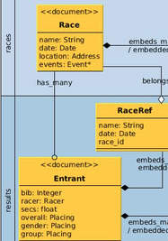

[`Races-Results Cross Collection`](docs/rsz_races_results_cross_collection.png)

1. Implement a Mongoid embedded model class called `RaceRef` (**Hint**:
`rails g model`) to hold information about the `Race` that queries of an 
`Entrant` will need to immediately know about.  This class must:

    * have a field called `name` of type String and mapped to the document key of `n`
    * have a field called `date` of type Date and mapped to the document key of `date`

    You can demonstrate your new model class using the rails console. In
    the following example, we locate a `Race` and then initialize the
    `RaceRef` using the `Race` attributes that are trimmed down to just the
    elements that `RaceRef` uses. Notice the few example fields in `Race`
    (e.g., `created_at`) that were not involved in the initialization of
    `RacerRef`. The `symbolize_keys` function is being used to make 
    sure that what we execute `slice` on uses symbols and not strings for 
    keys.

    ```ruby
    > race=Race.where(:name=>"Oakland 10K").first
     => #<Race _id: 5677a506e301d0e5e2000018, 
       created_at: 2015-12-21 07:06:46 UTC, updated_at: 2015-12-21 07:41:00 UTC, 
       n(name): "Oakland 10K", date: 2015-12-21 00:00:00 UTC, 
       loc(location): {"city"=>"Oakland", "state"=>"CA", ...


    > RaceRef.new(race.attributes.symbolize_keys.slice(:_id,:n,:date))
     => #<RaceRef _id: 5677a506e301d0e5e2000018, 
        n(name): "Oakland 10K", date: 2015-12-21 00:00:00 UTC>
    ```

    ```shell
    $ rspec spec/race_results_spec.rb -e rq01
    ```

2. Implement the 1:1 embedded relationship between `Entrant` and `RaceRef`. 

	 The `RaceRef` model class must:

    * name the `embedded_in` relationship `entrant`

    The `Entrant` model class must:

    * name the `embeds_one` relationship `race`
    * maps the `embeds_one` relationship to the `RaceRef` model class (otherwise
    it would incorrectly map to the `Race` model class)

    You can demonstrate your new relationship using the rails console. In the 
    example below we instantiate a new `Entrant` and then within the block, build
    the `RaceRef` and `save` to the database. Notice how we now have the `_id` 
    of the race as well as key information de-normalized into the `Entrant`
    compound document.

    ```ruby
    > entrant=Entrant.new {|r| \
        r.build_race(race.attributes.symbolize_keys.slice(:_id,:n,:date)); r.save }
     => #<Entrant _id: 56834b6ce301d07bcf0000b6, ...
    > pp entrant.attributes
    {"_id"=>BSON::ObjectId('56834b6ce301d07bcf0000b6'),
     "updated_at"=>2015-12-30 03:11:40 UTC,
     "created_at"=>2015-12-30 03:11:40 UTC,
     "race"=>
      {"_id"=>BSON::ObjectId('5677a506e301d0e5e2000018'),
       "n"=>"Oakland 10K",
       "date"=>2015-12-21 00:00:00 UTC}}
    ```

    ```shell
    $ rspec spec/race_results_spec.rb -e rq02
    ```

3. Implement the M:1 relationship between `Entrant`/`RaceRef` and `Race`. 
The foreign key will be in the `RaceRef` class embedded within `Entrant`. We will
use that as part of a `belongs_to` definition for the M:1 relationship from `Entrant`/`RaceRef`. 
`Race` will leverage the embedded foreign key to implement the inverse side using 
a `belongs_to`. The `RaceRef` embedded model class must:

    * name the `belongs_to` relationship `race`
    * map the `belongs_to` relationship to the `_id` document foreign key field. 
    (**Hint**: `foreign_key: "_id"`)

    The `Entrant` class must:

    * define a custom getter called `the_race` that returns the result of `race.race` --
    where the first `race` references the embedded `RaceRef` and the second `race`
    references the `Race` document in the other collection.

    The `Race` class must:

    * name the `has_many` relationship `entrants`
    * map the `has_many` relationship to the foreign key `race._id` which references
    the `_id` document field property within the embedded `RaceRef` stored using the 
    `race` field.  (**Hint**: `foreign_key: "race._id"`)
    * define a dependent constraint on the relationship to delete child
    `Entrant`s when the `Race` is deleted.
    * define a default sort order using the `secs` ASCENDING and `bib` number ASCENDING.
    This will order the entrants by bib# until times are reported. 
    (**Hint**: `order: [:secs.asc, :bib.asc]`)

    You can demonstrate your new relationship using the rails console. In the following
    example we create a new `Race` and two (2) `Entrant`s --
    filling in the attributes of the `RaceRef` using the `Race` instance. Each `Entrant`
    was also assigned a unique `bib` number and a value for `secs` that we can search
    for and help identify the entrant.

    ```ruby
    > race2=Race.create(:name=>"Oakland 2K", :date=>Date.current, :loc=>race.loc)               
    > entrant1=Entrant.new(:bib=>1, :secs=>1100.23) {|r| \
        r.build_race(race2.attributes.symbolize_keys.slice(:_id,:n,:date)); r.save }                 
    > entrant2=Entrant.new(:bib=>2, :secs=>1200.23) {|r| \
        r.build_race(race2.attributes.symbolize_keys.slice(:_id,:n,:date)); r.save }                               
    ```

    If we invoke the `race.name` method, we are requesting information from the local 
    collection embedded within `Entrant.RaceRef`. If we invoke the `the_race.loc.city`
    method, we are accessing a document from the parent collection.

    ```ruby
    > entrant1.race.name
     => "Oakland 2K" 
    > entrant2.the_race.loc.city
     => "Oakland" 
    ```

    We can issue queries from the parent collection to locate all child `Entrant`s or `Entrant`s
    matching a criteria. **Note** that query results for all `Entrant`s is ordered by 
    the default order defined in the parent model class.

    ```ruby
    > race2.entrants.pluck(:bib)
    D | {"find"=>"results", "filter"=>{"race._id"=>BSON::ObjectId('56836dffe301d07bcf0000c7')},
         "projection"=>{"bib"=>1}, "sort"=>{"bib"=>1}}
     => [1, 2] 
    > race2.entrants.where(:bib=>1).first.secs
    D | {"find"=>"results", "filter"=>{"race._id"=>BSON::ObjectId('56836dffe301d07bcf0000c7'), 
         "bib"=>1}, "sort"=>{"bib"=>1}}
     => 1100.23 
    ```

    If we delete the parent `Race`, all child `Entrant` documents are also deleted.

    ```ruby
    > race2.delete
    D | {"count"=>"results", "query"=>{"race._id"=>BSON::ObjectId('56836dffe301d07bcf0000c7')}}
    D | {"delete"=>"results", "deletes"=>[{"q"=>{"race._id"=>BSON::ObjectId('56836dffe301d07bcf0000c7')},...
    D | {"delete"=>"races", "deletes"=>[{"q"=>{"_id"=>BSON::ObjectId('56836dffe301d07bcf0000c7')},...
     => true 

    > Entrant.in(:id=>[entrant1.id,entrant2.id]).exists?
    D, | {"find"=>"results", "filter"=>{"_id"=>{
          "$in"=>[BSON::ObjectId('56836e17e301d07bcf0000c8'), BSON::ObjectId('56a660f1e301d0f1ed000037')]}}, 
          "projection"=>{"_id"=>1}, "limit"=>1}
     => false 
    ```

    ```shell
    $ rspec spec/race_results_spec.rb -e rq03
    ```

### Implement `racers`/`results` Cross-Collection Relationships

In this section you will implement model class aspects that cross the 
boundary between the `racers` and `results` collections.

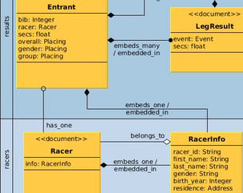

[`Racers-Results Cross Collection`](docs/rsz_racers_results_cross_collection.png)

1. Implement the bi-directional 1:1 embedded polymorphic relationship
between `Entrant` and `RacerInfo`.  `Racer` also holds a copy of this
information and will be considered the master copy. `Entrant` will store
a copy for the purpose of accessing during race result processing. The
`RacerInfo` class was fully implemented during an earlier requirement.
In the `Entrant` class, you must:

    * name the `embeds_one` relationship `racer`
    * define the `embeds_one` relationship polymorphic type as `parent`
    * map the `racer` relationship to the `RacerInfo` class. Otherwise
    Mongoid will attempt to embed the root level `Racer` class by default.

    You can demonstrate your new relationship using the rails console.
    In the following example, we locate a `Racer` and `Entrant` created 
    earlier (you can create new ones if required) and clone the 
    `RacerInfo` from the `Racer` into the `Entrant`. The result is a 
    compound document containing race-specific and racer-specific 
    information.

    ```ruby
    > racer=Racer.where(:"info.fn"=>"cat", :"info.ln"=>"inhat").first
    > entrant=Entrant.find_by(:bib=>1)
    > entrant.create_racer(racer.info.attributes)
    Overwriting existing field _id in class RacerInfo.
    > pp Entrant.find(entrant.id).attributes
    {"_id"=>BSON::ObjectId('5678cec8e301d0e5e2000031'),
     "bib"=>1,
     "secs"=>1100.123,
     "o"=>{"place"=>10},
     "gender"=>{"name"=>"M", "place"=>8},
     "group"=>{"name"=>"masters", "place"=>5},
     "updated_at"=>2015-12-22 04:18:40 UTC,
     "created_at"=>2015-12-22 04:18:40 UTC,
     "racer"=>
      {"fn"=>"cat",
       "ln"=>"inhat",
       "g"=>"M",
       "yr"=>1940,
       "res"=>
        {"city"=>"Oakland",
         "state"=>"CA",
         "loc"=>{"type"=>"Point", "coordinates"=>[-122.27, 37.8]}},
       "racer_id"=>BSON::ObjectId('568070e3e301d07bcf000012'),
       "_id"=>BSON::ObjectId('568070e3e301d07bcf000012')}}
    ```

    Your focus above should have been on the fact that a copy of the `RacerInfo`
    is now embedded within the `Entrant`. If we inspect both the `racer.info` and 
    `entrant.info`, we see the same state is represented. It is also verify
    important that your database document for `entrant.racer` have the `racer_id`
    property. This was a field we custom mapped to represent `_id` and represents
    our foreign key to the `Racer`. 

    ```ruby
    > racer.info
     => #<RacerInfo _id: 56a5aedce301d09b38000003, racer_id(id): nil, fn(first_name): "cat", 
        ln(last_name): "inhat", g(gender): "M", yr(birth_year): 1940, res(residence):
        {"city"=>"Oakland", "state"=>"CA", "loc"=>{"type"=>"Point", "coordinates"=>[-122.27, 37.8]}}> 
    > entrant.racer
     => #<RacerInfo _id: 56a5aedce301d09b38000003, racer_id(id): nil, fn(first_name): "cat", 
        ln(last_name): "inhat", g(gender): "M", yr(birth_year): 1940, res(residence):
        {"city"=>"Oakland", "state"=>"CA", "loc"=>{"type"=>"Point", "coordinates"=>[-122.27, 37.8]}}> 
    ```

    `RacerInfo` already has validation defined. In this example, we show that
    `Entrant` will be invalid if `RacerInfo` is invalid.

    ```ruby
    > entrant=Entrant.new          
    > racer=entrant.build_racer    
    > entrant.validate             
     => false 
    > entrant.errors.messages      
     => {:racer=>["is invalid"]} 
    > pp racer.errors.messages
    {:first_name=>["can't be blank"],
     :last_name=>["can't be blank"],
     :gender=>["can't be blank", "must be M or F"],
     :birth_year=>["can't be blank", "must in past"]}
    ```

    ```shell
    $ rspec spec/racer_results_spec.rb -e rq01
    ```

2. Implement the 1:M relationship between `Racer` and `Entrant`. The foreign key 
will be stored in the `Entrant.RacerInfo` embedded class. 
The `Racer` class must:

    * name the `has_many` relationship `races`
    * map the `has_many` relationship to the `Entrant` model class
    * map the `has_many` relationship foreign key to the `racer.racer_id` document key
    * define `has_many` relationship with a dependent constraint of `:nullify`
    * define `has_many` relationship with a default sort order of `race.date`, DESCENDING.
    (**Hint**: `order: :"race.date".desc`. The rspec test will not pass if you use an 
    array notation here)

    You can demonstrate your new method with the query application logic 
    using the rails console. In the following example an existing `Racer`
    with an extisting `Entrant` is retrieved and queried for `races`.
    The result is a collection of `Entrants` (with just the only one (1)).

    ```ruby
    > racer=Racer.where(:"info.fn"=>"cat", :"info.ln"=>"inhat").first
    > racer.races.to_a
    => [#<Entrant _id: 5678cec8e301d0e5e2000031, 
         created_at: 2015-12-22 04:18:40 UTC, updated_at: 2015-12-22 04:18:40 UTC, bib: 1, 
         secs: 1100.123, entr
         o(overall): {"place"=>10}, 
         gender: {"name"=>"M", "place"=>8}, 
         group: {"name"=>"masters", "place"=>5}, race_id: nil>] 
    ```

    **Hint**: If your `Racer` does not show any entrants in the collection 
    it could be because we are specifying the foreign key as `race.racer_id`
    and your `RacerInfo` is not successfully mapping `_id` to `racer_id`.

    ```shell
    $ rspec spec/racer_results_spec.rb -e rq02
    ```

### Implement Attribute Delegation

Before we build the web interface there are a few data tier interface issues
we need to address and simplify to be able to work with the default views
that Rails scaffold will generate for us.

  * nested data
  * custom type properties

The generated views work much better out-of-the-box when we hide the fact
that we have used embedded classes. For example, the generate view
just wants to access the `Entrant.race_date` or the `Racer.city`
and not have to know to access the `Entrant.race.date` or the
`Racer.info.residence.city`. In addition, the view would
get undesirably complicated with nil checks as they navigated the nested document
tree. Since our focus is on the data tier and a quick/easy visualization
of the data tier, we are going to solve the access facade here.

To solve the nesting issue in the data tier, you may use brute-force to implement
setters and getters for nested data or make use of of Active Model's
[`delegate`](http://api.rubyonrails.org/classes/Module.html#method-i-delegate)
feature, which allows us to define getter/setter methods in the parent class 
and delegate them to the nested objects holding the information. Everything 
appears to be at the parent level from the external view.

To complicate matters, Mongoid manages the custom types differently. Every
access to the custom type appears to invoke a call to `demongoize` from
a database hash form.  You cannot get the instance, set a property of
the instance, and have that have any affect without replacing the entire
instance with the values you want in place. We can also hide this 
complexity with brute force using custom setters and getters. However,
those extra checks can get tedious when repeated for each property in
the custom type. To simplify this issue we will show Ruby's
[`metaprogramming`](https://rubymonk.com/learning/books/2-metaprogramming-ruby/chapters/25-dynamic-methods/lessons/72-define-method)
features, which allows us to dynamically add methods to parent classes
using an abstract definition.

Lets make interface simplifications to the `Racer`, `Race`, and `Entrant`
classes.  Since this was not specifically covered within class, much of
the code will be provided for you.


1. Implement a flattened view of properties in the `Racer` such that the 
following already implemented properties are available to the view.

    * expose `info.first_name` as `first_name`
    * expose `info.last_name` as `last_name`
    * expose `info.gender` as `gender`
    * expose `info.birth_year` as `birth_year`
    * expose `info.residence.city` as `city`
    * expose `info.residence.state` as `state`

    **Hint**: In the `Racer` class, add delegation specifications for the following
    properties.

    ```ruby
    class Racer
      ...
      delegate :first_name, :first_name=, to: :info
      delegate :last_name, :last_name=, to: :info
      delegate :gender, :gender=, to: :info
      delegate :birth_year, :birth_year=, to: :info
      delegate :city, :city=, to: :info
      delegate :state, :state=, to: :info
    ```

    With the delegation in place, you can demonstrate some functionality 
    for the properties maintained directly within `RacerInfo` but not yet
    for `city` and `state`. In the example below, we start with a mass assignment
    of the `RacerInfo` properties passed to `Racer` and having them delegated
    to their proper locations. We can call the getter/setters at each level 
    and arrive at the same value. The stored document shows the information
    embedded within the `info` property.

    **Hint**: If you get `Mongoid::Errors::UnknownAttribute:` 
    * re-check your mappings
    * verify you have saved your editor with the mappings
    * verify you have executed `reload!` within the rails console to pick up
    the new mappings

    ```ruby
    > racer=Racer.new(:first_name=>"thing",:last_name=>"two",:gender=>"M",:birth_year=>1960)
    > racer.info.last_name
     => "two" 
    > racer.last_name
     => "two" 
    > racer.last_name="three"
     => "three" 
    > racer.validate
     => true 
    > racer.save
    > pp Racer.find(racer.id).attributes
    {"_id"=>BSON::ObjectId('568874bae301d009f0000084'),
     "info"=>
      {"fn"=>"thing",
       "ln"=>"three",
       "g"=>"M",
       "yr"=>1960,
       "racer_id"=>BSON::ObjectId('568874bae301d009f0000084')}}
    ```

    **Hint(s)**: To compensate for the getter/setter versus bulk replacement
    issue for custom types, we could consider adding the following logic
    to the `RacerInfo` class. This would work. The getter handles the
    case where the residence is nil and the setter makes sure to do
    a bulk assignment using an instance initialized with the current
    values. 

    ```ruby
    class RacerInfo
      def city
        self.residence ? self.residence.city : nil
      end
      def city= name
        object=self.residence ||= Address.new
        object.city=name
        self.residence=object
      end
    ```

    However, the above brute force solution repeated for each property
    becomes tedious by unnecessarily having to repeat the same block of
    code for each property in the custom type and you may want to use
    the next approach.  Consider instead leveraging `metaprogramming`
    and dynamically create a getter/setter of the above design for each
    property we care about.

    * `define_method` declares a block of code that defines a particular
    method and that method can optionally take parameters (e.g., `do |action|`)
    * `object.send("m",123)` invokes a method ("m") on the object and can 
    optionally pass parameters to that method (e.g., 123)
    
        * just as `name and name=(param)` are getter and setters for name --
        `object.send("name") and object.send("name=", value)` are also 
        getter and setter methods that can dynamically access object 
        methods without knowing the type ahead of time.
    
    The following code block demonstrates creating a getter and setter
    method for each of our `Address` properties within the `RacerInfo`
    class -- making sure to apply the single field change to an 
    entire instance of Account that was created from the current state
    and re-assigned as a whole object.

    * `city` and `state` are defined in an array that is passed in as the 
    `action` to perform
    * two methods are created; `(action)` and `(action)=` to act as the
    getter and setter for that property
    * both perform nil checks on the residence
    * the getter pulls the desired field from the embedded custom type
    * the setter applies the value to the desired field and re-assigns
    the state for the the entire custom type

    ```ruby
    class RacerInfo
      ...
      ["city", "state"].each do |action|
        define_method("#{action}") do 
          self.residence ? self.residence.send("#{action}") : nil
        end
        define_method("#{action}=") do |name|
          object=self.residence ||= Address.new
          object.send("#{action}=", name)
          self.residence=object
        end
      end
    ```

    **Hint**: The call to `Address.new` relies on the fact that there
    is an `Address`.initialize()` that will accept no arguments.
    Make adjustments to your implementation as necessary to create
    a default instance.

    You can now demonstrate the rest of your flattened embedded fields
    using the rails console.  The following shows the `city` and `state`
    being accessed thru the dynamically added setters and getters and these
    methods performing the logic required to make sure out `RacerInfo`
    gets updated properly with `Address` information.
    
    ```ruby
    > racer=Racer.find(racer.id)
    > racer.city
     => nil 
    > racer.city="Oakland"
     => "Oakland" 
    > racer.state="CA"
    > racer.info.residence
     => #<Address:0x000000053b6258 @city="Oakland", @state="CA", @location=nil> 
    > racer.save
    > pp Racer.find(racer.id).attributes
    {"_id"=>BSON::ObjectId('568874bae301d009f0000084'),
     "info"=>
      {"fn"=>"thing",
       "ln"=>"three",
       "g"=>"M",
       "yr"=>1960,
       "racer_id"=>BSON::ObjectId('568874bae301d009f0000084'),
       "res"=>{"city"=>"Oakland", "state"=>"CA"}}}
    ```

    ```shell
    $ rspec spec/flatten_attributes_spec.rb -e rq01
    ```

2. Implement a flattened and default configuration for `Race`. The class must:

    * have properties called `swim_order`, `swim_distance`, and `swim_units`
    that default to 0, 1, and "miles"
    * have a property called `t1_order` that defaults to 1
    * have properties called `bike_order`, `bike_distance`, and `bike_units`
    that default to 2, 25, and "miles"
    * have a property called `t2_order` that defaults to 3
    * have properties called `run_order`, `run_distance`, and `run_units`
    that default to 4, 10, and "kilometers"
    * have the ability to get and set each of the above event properties
    * have a class method called `default` that returns a default instance
    of `Race` with the above properties
    * expose `location.city` as `city`
    * expose `location.state` as `state`

    **Hint**: It would likely help to start with a data hash that defines the default properties.

    ```ruby
    DEFAULT_EVENTS = {"swim"=>{:order=>0, :name=>"swim", :distance=>1.0, :units=>"miles"},
                      "t1"=>  {:order=>1, :name=>"t1"},
                      "bike"=>{:order=>2, :name=>"bike", :distance=>25.0, :units=>"miles"},
                      "t2"=>  {:order=>3, :name=>"t2"},
                      "run"=> {:order=>4, :name=>"run", :distance=>10.0, :units=>"kilometers"}}
    ```

    **Hint**: Your solution might use explicit methods written using brute force
    for each event and property.

    ```ruby
    def swim
      event=events.select {|event| "swim"==event.name}.first
      event||=events.build(DEFAULT_EVENTS["swim"])
    end
    def swim_order
      swim.order
    end
    def swim_distance
      swim.distance
    end
    def swim_units
      swim.units
    end
    ```

    However, you will likely find the following metadataprogramming 
    definition helpful. The outer loop is driven by the keys of 
    the DEFAULT_EVENT hash shown above and defines the implementation
    for getting and/or creating the event. The inner loop conditionally
    creates and getter/setter for the lower-level property if a value 
    exists in the hash.

    ```ruby
    DEFAULT_EVENTS.keys.each do |name|
      define_method("#{name}") do 
        event=events.select {|event| name==event.name}.first
        event||=events.build(DEFAULT_EVENTS["#{name}"])
      end
      ["order","distance","units"].each do |prop|
        if DEFAULT_EVENTS["#{name}"][prop.to_sym]
          define_method("#{name}_#{prop}") do 
            event=self.send("#{name}").send("#{prop}")
          end
          define_method("#{name}_#{prop}=") do |value|
            event=self.send("#{name}").send("#{prop}=", value)
          end
        end
      end
    end
    ```

    You can demonstrate your flattened `Race` class with default 
    properties using the rails console. In the following example
    a new `Race` is created. A default `swim` is added once accessed.
    A default `bike` is added once the `bike_distance` is accessed.
    A default `run` is added once the `run_distance=` is accessed
    to set the event to 222 miles.

    ```ruby
    > race=Race.new
     > race.swim
     => #<Event _id: 56889d46e301d009f00000c6, o(order): 0, n(name): "swim", d(distance): 1.0, u(units): "miles"> 
     > race.bike_distance
     => 25.0 
     > race.run_distance=222
     => 222 
    > pp race.events.to_a
    [#<Event _id: 56889d46e301d009f00000c6, o(order): 0, n(name): "swim", d(distance): 1.0, u(units): "miles">,
     #<Event _id: 56889d7ae301d009f00000c7, o(order): 2, n(name): "bike", d(distance): 25.0, u(units): "miles">,
     #<Event _id: 56889d7ae301d009f00000c8, o(order): 4, n(name): "run", d(distance): 222.0, u(units): "kilometers">]
    ```

    **Hint**: Given a source of event keys (e.g., `DEFAULT_EVENTS.keys`), it 
    would be easy to implement a default instance of the `Race` in the 
    following manner.

    ```ruby
    def self.default 
      Race.new do |race|
        DEFAULT_EVENTS.keys.each {|leg|race.send("#{leg}")}
      end
    end
    ```

    ```ruby
    > race=Race.default
    > race.save
    > pp Race.find(race.id).attributes
    {"_id"=>BSON::ObjectId('56995119e301d0330000005d'),
     "next_bib"=>0,
     "updated_at"=>2016-01-15 20:06:01 UTC,
     "created_at"=>2016-01-15 20:06:01 UTC,
     "events"=>
      [{"_id"=>BSON::ObjectId('56995129e301d0330000005e'),
        "o"=>0,
        "n"=>"swim",
        "d"=>1.0,
        "u"=>"miles"},
       {"_id"=>BSON::ObjectId('56995129e301d0330000005f'), "o"=>1, "n"=>"t1"},
       {"_id"=>BSON::ObjectId('56995129e301d03300000060'),
        "o"=>2,
        "n"=>"bike",
        "d"=>25.0,
        "u"=>"miles"},
       {"_id"=>BSON::ObjectId('56995129e301d03300000061'), "o"=>3, "n"=>"t2"},
       {"_id"=>BSON::ObjectId('56995129e301d03300000062'),
        "o"=>4,
        "n"=>"run",
        "d"=>10.0,
        "u"=>"kilometers"}]}
    ```

    We can use the technique we used in the `RacerInfo` class to provided flattened
    access to `city` and `state` within `Race.location`

    ```ruby
    class Race
      ...
      ["city", "state"].each do |action|
        define_method("#{action}") do 
          self.location ? self.location.send("#{action}") : nil
        end
        define_method("#{action}=") do |name|
          object=self.location ||= Address.new
          object.send("#{action}=", name)
          self.location=object
        end
      end
    ```

    You can now demonstrate your completed `Race` class with flattened properties
    for all events and location information. The following example shows a `Race` being
    created and passed into a block where a set of methods are invoked against the `Race`.
    The output is displayed on the following lines.

    ```ruby
    > Race.new(city:"LA",state:"CA").tap {|race|
          ["swim_order","t1","bike_distance","t2","run_units","city","state"].map {|event|
            pp race.send(event)
         }
       }
    0
    #<Event _id: 5688a11ae301d009f00000d5, o(order): 1, n(name): "t1", d(distance): nil, u(units): nil>
    25.0
    #<Event _id: 5688a11ae301d009f00000d6, o(order): 3, n(name): "t2", d(distance): nil, u(units): nil>
    "kilometers"
    "LA"
    "CA"
    ```

    ```shell
    $ rspec spec/flatten_attributes_spec.rb -e rq02
    ```

3. Add flattened property support to your `Entrant` class relative to `Race` and `Racer`. This class must:

    * expose `racer.first_name` as `first_name`
    * expose `racer.last_name` as `last_name`
    * expose `racer.gender` as `racer_gender` (**Hint**: note the prefix)
    * expose `racer.birth_year` as `birth_year`
    * expose `racer.residence.city` as `city`
    * expose `racer.residence.state` as `state`
    * expose `race.name` as `race_name`
    * expose `race.date` as `race_date`
    * expose `group.name` as `group_name` and returning nil if group does not exist
    * expose `group.place` as `group_place` and returning nil if group does not exist
    * expose `overall.place` as `overall_place` and returning nil if overall does not exist
    * expose `gender.place` as `gender_place` and returning nil if gender does not exist

    * add `autobuild` to the `race` and `racer` `embeds_one` relation so that 
    we can guarantee that the embeded instances will be in place to hold 
    properties when accessed and updated.


    **Hint**: The `RacerInfo` properties can be handled the same as we did with
    `Race` with the use of `delegate` but a different property name.
    To get `racer_` prefix added to the `gender` property, add a `prefix`
    specification to the definition.

    ```ruby
    delegate :first_name, :first_name=, to: :racer
    delegate :last_name, :last_name=, to: :racer
    delegate :gender, :gender=, to: :racer, prefix: "racer"
    delegate :birth_year, :birth_year=, to: :racer
    delegate :city, :city=, to: :racer
    delegate :state, :state=, to: :racer
    ```

    **Hint**: The `RaceRef` properties require a `race_` prefix added 
    to the property and can also be handled by delegate with a 
    prefix specified.

    ```ruby
    delegate :name, :name=, to: :race, prefix: "race"
    delegate :date, :date=, to: :race, prefix: "race"
    ```

    **Hint**: The nil check delegation to the custom classes would be 
    easiest implemented through a set of custom accessor methods.

    ```ruby
    def overall_place
      overall.place if overall
    end
    def gender_place
      gender.place if gender
    end
    def group_name
      group.name if group
    end
    def group_place
      group.place if group
    end
    ```

    **Hint**: Don't forget to add `autobuild` to the two `embeds_one` 
    relationships so the embedded objects will be created when needed.

    ```ruby
    embeds_one :race, class_name: "RaceRef", autobuild: true
    embeds_one :racer, class_name: "RacerInfo", as: :parent, autobuild: true
    ```

    With the delegates in place, you can demonstrate your flat access
    to `Entrant` properties using the rails console. The following example
    shows a root-level property and two embedded properties set in the 
    `Entrant` and then accessed using reflection.

    ```ruby
    > ["bib","first_name","race_name"].map {|prop| \
          Entrant.new(:bib=>0,:first_name=>"thing",:race_name=>"123").send(prop)}
     => [0, "thing", "123"] 
    ```

    We now should have an `Entrant` interface that the views can safely and 
    simply access without nesting and nil checks.

    ```shell
    $ rspec spec/flatten_attributes_spec.rb -e rq03
    ```

4. Add flattened property support to your `Entrant` class relative to `LegResult`. 
The `Entrant` class must:

    * have properties called `swim`, `t1`, `bike`, `t2`, `run` that
    map to events within the `events` collection found by `event.name`
    and are of type `SwimResult`, `LegResult`, `BikeResult`, `LegResult`,
    and `RunResult` respectively.
    * have properties called `swim_secs` and `swim_pace_100` that map
    to `swim.secs` and `swim.pace_100`
    * have a property called `t1_secs` that maps to `t1.secs`
    * have properties called `bike_secs` and `bike_mph`
    that maps to `bike.secs` and `bike.mph`
    * have a property called `t2_secs` that maps to `t2.secs`
    * have properties called `run_secs` and `run_mmile`
    that maps to `run.secs` and `run.mmile`
    * have the ability to get and set each of the above event properties
    within the events found by `event.name`

    **Hint**: The above can be written out one-by-one and fully function.
    However, you may want to try metaprogramming to reduce much of the
    redundancy of code. We can start with a mapping of event names to 
    result class implementations.

    ```ruby
    RESULTS = {"swim"=>SwimResult, 
               "t1"=>LegResult, 
               "bike"=>BikeResult, 
               "t2"=>LegResult, 
               "run"=>RunResult}
    ```

    We then can begin with an outer loop targeted at each event name.

    ```ruby
    RESULTS.keys.each do |name|
      #create_or_find result
      #assign event details to result
      #expose setter/getter for each property of each result 
    end
    ```

    Within the outer loop we can define our getter method for the event
    that will either find the event within the `events` collection or 
    create a new one that has been inserted into the collection.

    ```ruby
      #create_or_find result
      define_method("#{name}") do 
        result=results.select {|result| name==result.event.name if result.event}.first
        if !result
          result=RESULTS["#{name}"].new(:event=>{:name=>name})
          results << result
        end
        result
      end
    ```

    The next block defines a method that will assign event details to 
    a result. The previous getter method is used to locate or create 
    the result and this will embed the details of the event in that 
    result.

    ```ruby
      #assign event details to result
      define_method("#{name}=") do |event|
        event=self.send("#{name}").build_event(event.attributes)
      end
    ```

    Next we expose a getter/setter for each attribute in the result
    classes. This should end up adding a `_secs` and an event-specific
    property to the `Entrant` class. The setter method manually calls
    the collection callback to re-calculate the total `secs` since 
    we are not changing the collection at this time -- only changing
    the result within the collection.
      
    ```ruby
      #expose setter/getter for each property of each result
      RESULTS["#{name}"].attribute_names.reject {|r|/^_/===r}.each do |prop|
        define_method("#{name}_#{prop}") do
          event=self.send(name).send(prop)
        end
        define_method("#{name}_#{prop}=") do |value|
          event=self.send(name).send("#{prop}=",value)
          update_total nil  if /secs/===prop
        end
      end
    end
    ```

    With the wrapper methods in place, you can demonstrate your flattened
    `Entrant` class result properties using the rails console. In the 
    following example we create a small race with just two legs; `swim`
    and `t1`. We then create an `Entrant` and assign the event details
    from the `Race` to the `Entrant.results`. Type-specific methods are
    beging called to create the correct sub-class of `LegResult`.

    ```ruby
    > entrant=Entrant.new
    > race=Race.new.tap {|race| ["swim","t1"].each {|event|race.send(event)}}
    > entrant.swim=race.swim
     => #<Event _id: 5688d838e301d009f000016c, o(order): 0, n(name): "swim", d(distance): 1.0, u(units): "miles"> 
    > entrant.t1=race.t1
     => #<Event _id: 5688d846e301d009f000016e, o(order): 1, n(name): "t1", d(distance): nil, u(units): nil> 
    ```

    At this point we can assign times using `swim_secs` and `t1_secs` methods.
    This updates the overall time and stores the result with event-specific averages
    calculated.

    ```ruby
     > entrant.swim_secs=1000
     => 1000 
     > entrant.t1_secs=100
     => 100 
     > entrant.secs
     => 1100.0 
     > pp entrant.results.to_a
    [#<SwimResult _id: 5688d74ae301d009f0000168, secs: 1000.0, _type: "SwimResult", pace_100: 62.13727366498068>,
     #<LegResult _id: 5688d74ae301d009f0000169, secs: 100.0, _type: "LegResult">]
    ```

    We can gain access to the specific properties using the flattened accessor methods.

    ```ruby
    > entrant.swim_pace_100
     => 62.13727366498068 
    > entrant.swim_secs
     => 1000.0 
    ```

    ```shell
    $ rspec spec/flatten_attributes_spec.rb -e rq04
    ```

### Implement Cross-Collection Service Requests

In this section we will implement logic that must leverage multiple collections
to complete the use case. This is helper code for the web application to 
easily access with the model. We could have broken this out into separate
service logic, but have wrapped it in the specific model classes in a
small attempt to simplify the implementation and assignment.

1. Update the `Race` model class to support a centralized registry
for bib numbers within a `Race`. We can tolerate gaps, but cannot have
duplicates. The class must:

    * add a new `next_bib` field as type Integer, mapped to the document
    key `next_bib`, and with a default value of 0. (**Hint**: assign a
    [default value](https://docs.mongodb.org/ecosystem/tutorial/mongoid-documents/#defaults)
    at document creation time and not instance creation time)
    * override the getter for this field so that the implementation will
    perform an 
    [`atomic increment`](https://docs.mongodb.org/ecosystem/tutorial/mongoid-persistence/#atomic)
    of the `next_bib` value in the database and return the result of 
    `next_bib`. (**Hint**: use `[:key]` to access the current value of 
    the attribute to avoid an infinite loop within `next_bib`.)
    
    You can demonstrate your new field and how to increment it using the
    rails console. The following demonstrates how the getter performs
    an atomic update on the `next_bib` field in the database and returns
    that value.  This assures us that there will be only one use of a bib
    number as long as the state of that database field is not overwritten.
    For efficiency, no other state is involved in the database update.
    We control the amount of the increment, so bulk operations involving
    multiple `Entrants` could be efficiently implemented as well.

    ```ruby
    > race=Race.create
    > race.next_bib
    D {"update"=>"races", "updates"=>[{"q"=>{"_id"=>BSON::ObjectId('56880945e301d009f0000042')}, 
       "u"=>{"$inc"=>{"next_bib"=>1}}, "multi"=>false, "upsert"=>false}]...
     => 1 
    > race.next_bib
    D {"update"=>"races", "updates"=>[{"q"=>{"_id"=>BSON::ObjectId('56880945e301d009f0000042')}, 
       "u"=>{"$inc"=>{"next_bib"=>1}}, "multi"=>false, "upsert"=>false}]...
     => 2 
    ```

    The following shows accessing the current value of `next_bib` without
    calling the custom getter and changing the value.

    ```ruby
    > race[:next_bib]
     => 2 
    > race[:next_bib]
     => 2 
    ```

    ```shell
    $ rspec spec/service_facade_spec.rb -e rq01
    ```

2. Implement a `get_group` instance method within the `Race` class that will
return a `Placing` instance with its name set to the name of the age group
the racer will be competing in. The method must:

    * determine the age of the racer on January 01, of the year of the race
    * place the racer in a group that is rounded down to the nearest
    10s and rounded up to the nearest 9s. Example: 26 would be `20 to 29`.
    * the cut-off for masters is 60 (e.g., 59 is `50..59` and 60 is `masters`)
    * groups have the following text formats
    ```ruby
    "#{min_age} to #{max_age} (#{gender})"
    "masters #{gender}"
    ```

    **Hint**: Consider using the following. It is written to use demongoize so
    that it does not mandate a specific initialize method.

    ```ruby
    def get_group racer
      if racer && racer.birth_year && racer.gender
        quotient=(date.year-racer.birth_year)/10
        min_age=quotient*10
        max_age=((quotient+1)*10)-1
        gender=racer.gender
        name=min_age >= 60 ? "masters #{gender}" : "#{min_age} to #{max_age} (#{gender})"
        Placing.demongoize(:name=>name)
      end
    end
    ```

    You can demonstrate your instance method using the rails console.
    The following calculates a group for a race in 2010 and racer birth
    years incremented by 10.

    ```ruby
    > pp (1943..2003).step(10).map {|yr| \
      Race.new(:date=>Date.new(2010)).get_group(Racer.new(:gender=>"M", :birth_year=>yr)).name}
    ["masters M",
     "50 to 59 (M)",
     "40 to 49 (M)",
     "30 to 39 (M)",
     "20 to 29 (M)",
     "10 to 19 (M)",
     "0 to 9 (M)"]
    ```

    ```shell
    $ rspec spec/service_facade_spec.rb -e rq02
    ```

3. Implement `create_entrant` instance method in the `Race` class that will
create a new `Entrant` for the `Race` for a supplied `Racer`. This method will
update two collections; `races` and `results`. `races` will have the `next_bib`
number of a `Race` document updated and `results` will have a new `Entrant`
document inserted with information cloned from both `Race` and `Racer`.  
This method must:

    * build a new `Entrant` (**Hint**: `Entrant.new`)
    * clone the relevant `Race` information within `Entrant.race` 
    (**Hint**: `race.attributes.symbolize_keys.slice(:_id, :n, :date)`)
    * clone the `RacerInfo` attributes within `Entrant.racer`
    (**Hint**: `racer.info.attributes`)
    * determine the group for the racer and assign it to the entrant
    (**Hint**: `get_group(racer)`)
    * create an `Entrant` result for every `Race` event
    (**Hint**: `entrant.send("#{event.name}=", event)`)
    * validate the `Entrant` (**Hint**: `entrant.validate`)
    * if valid, assign a new unique `bib` number from the database using an 
    `atomic increment` and save to the database. (**Hint**: `next_bib`)
    * return the `Entrant`

    If the `Entrant` was valid, it will be successfully stored in the database
    and the `next_bib` will be incremented for the `Race`. If the `Entrant` is
    invalid, the `Entrant` will not be stored, the `next_bib` will not be
    modified, and the returned object will have the validation information 
    informing the caller of the errors.

    You can demonstrate your new method for creating `Entrants` using the 
    rails console. The following is an example of an invalid registration.
    An empty `Racer` is provided, the entrant is invalid, and not saved to 
    the database. In addition to not being saved, the `next_bib` for the 
    `Race` has not been modified and the returned object(s) have the associated
    validation error information.

    ```ruby
    > race=Race.new
    > race[:next_bib]
     => 0 
    > entrant=race.create_entrant Racer.new
    > entrant.valid?
     => false 
    > entrant.persisted?
     => false 
    > race[:next_bib]
     => 0 
    > entrant.errors.messages
     => {:racer=>["is invalid"]} 
    > pp entrant.racer.errors.messages
    {:first_name=>["can't be blank"],
     :last_name=>["can't be blank"],
     :gender=>["can't be blank", "must be M or F"],
     :birth_year=>["can't be blank", "must in past"]}
    ```

    The following is an example of a successful registration. We start
    off creating a default `Race` and locating a `Race` from the database
    we know was valid (you can create new ones if required).  To start
    fresh, the existing `Racer` is cleared of any previous `Entrant` state
    and re-queried for. The re-query is needed because we have a non-standard
    relationship defined to a foreign key in an embedded class (`Entrant.racer`).
    Mongoid is not able to full clear the in-memory representation following the 
    delete without getting a new copy from the database.

    ```ruby
    > race=Race.default; race.name="A Race"; race.date=Date.current; race.save
    > racer=Racer.where(:"info.fn"=>"cat", :"info.ln"=>"inhat").first
    > racer.races.each {|r| r.delete }
    > racer=Racer.find(racer.id)
    ```

    We have no relationships at this point and the `next_bib` is set to 0.

    ```ruby
    > racer.races.count
     => 0
    > race.entrants.count
     => 0 
    > race[:next_bib]
     => 0 
    ```

    When we create the valid entrant, an atomic update is issued to the database to increment
    the `next_bib` of the `Race`  and the `Entrant` is inserted. **Note** that the relevant 
    information from the `Race` and `Racer` are cloned and embedded within 
    the `Entrant` for efficient access to this associated information when accessing the `Entrant`.
    
    ```ruby
    > entrant=race.create_entrant racer
    Overwriting existing field _id in class RacerInfo.
    D | {"insert"=>"results", "documents"=>[{"_id"=>BSON::ObjectId('56a6be93e301d019a000003d'), 
         "secs"=>0.0, "group"=>{:name=>"masters M"}, "bib"=>1, 
         "updated_at"=>2016-01-26 00:32:19 UTC, "created_at"=>2016-01-26 00:32:19 UTC, 
         "race"=>{"_id"=>BSON::ObjectId(...
    > entrant.persisted?
     => true 
    > entrant.valid?
     => true 
    > entrant.bib
     => 1 
    > race[:next_bib]
     => 1 
    > entrant.results.pluck(:"event.n")
     => ["swim", "t1", "bike", "t2", "run"] 
    > entrant.race_name
     => "A Race" 
    > entrant.last_name
     => "inhat" 
    > entrant.city
     => "Oakland" 
    > entrant.swim.event.distance
     => 1.0 
    ```

    If we refresh the state of our parent collections (because of the embedded foreign keys)
    and list their contents, they will show the relevant `Entrant` information.

    ```ruby
    > race=Race.find(race.id)
    > race.entrants.each {|r| p "#{r.bib}, #{r.racer.first_name}, #{r.racer.last_name}"}
    "1, cat, inhat"

    > racer=Racer.find(racer.id)
    > racer.races.each {|r| p "#{r.race.name}, #{r.race.date}, #{r.bib}"}
    "A Race, 2016-01-26, 1"
    ```

    ```shell
    $ rspec spec/service_facade_spec.rb -e rq03
    ```

4. Implement a [`named scope`](https://docs.mongodb.org/ecosystem/tutorial/mongoid-queries/#named-scopes)
in the `Entrant` class called by `upcoming` and `past` that returns a chainable
criteria for Entrants that have not completed and have occured in the past. These 
scopes must:

    * return a chainable Mongoid query criteria set to return matching `Entrant`
    documents based on the `:race.date` property
    
      - `upcoming` races have dates greater than or equal to today's date
      - `past` races have dates less than today's date

    You can use the Rails console to demonstrate your new named scopes.
    In the example below we create three (3) races (in the past, present,
    and future) and use the method we just implemented to create an entrant 
    in each of them.

    ```ruby
    > race1=Race.create(:name=>"Yesterday's Entrant",:date=>Date.yesterday) 
    > race2=Race.create(:name=>"Today's Entrant",:date=>Date.today)              
    > race3=Race.create(:name=>"Tomorrow's Entrant",:date=>Date.tomorrow)    
    > racer=Racer.create(:first_name=>"thing",:last_name=>"two",:gender=>"M",:birth_year=>1960)              
    > race1.create_entrant(racer)
    > race2.create_entrant(racer)
    > race3.create_entrant(racer)
    ```

    When we use the `past` scope we get a criteria looking for `Entrant` documents
    in the past. When we add a `where()` clause to that, the two are combined.
    One interesting thing to note is that the criteria for the embedded document
    is being passed raw to the MongoDB driver -- so we must use the physical key
    names in the database and not the logical attribute names in the embedded model class.

    ```ruby
    > pp Entrant.past.where(:"race.n"=>{:$regex=>"Entrant"}).first.attributes                               
    D | {"find"=>"results", "filter"=>{"race.date"=>{"$lt"=>2016-01-15 00:00:00 UTC}, "race.n"=>{:$regex=>"Entrant"}}}
    {"_id"=>BSON::ObjectId('56990913e301d03300000019'),
     "bib"=>1,
     "updated_at"=>2016-01-15 14:58:27 UTC,
     "created_at"=>2016-01-15 14:58:27 UTC,
     "race"=>
      {"_id"=>BSON::ObjectId('569908c9e301d03300000015'),
       "n"=>"Yesterday's Entrant",
       "date"=>2016-01-14 00:00:00 UTC},
     "racer"=>
      {"fn"=>"thing",
       "ln"=>"two",
       "g"=>"M",
       "yr"=>1960,
       "racer_id"=>BSON::ObjectId('56990905e301d03300000018'),
       "_id"=>BSON::ObjectId('56990905e301d03300000018')}}

    ```

    Notice we can use the scope on relationships. In the following
    example, we can locate upcoming races the racer is registered for and
    add `pluck` to get the information we need.  In practice, it was found best
    to avoid getting too agressive with fine-grain plucks into sub-documents.

    ```ruby
    > pp racer.races.upcoming.pluck(:race)
    D | {"find"=>"results", "filter"=>{"racer.racer_id"=>BSON::ObjectId('56990905e301d03300000018'), 
                                       "race.date"=>{"$gte"=>2016-01-15 00:00:00 UTC}}, 
                                       "projection"=>{"race"=>1}, "sort"=>{"race.date"=>-1}}
    [{"_id"=>BSON::ObjectId('569908eee301d03300000017'),
      "n"=>"Tomorrow's Entrant",
      "date"=>2016-01-16 00:00:00 UTC},
     {"_id"=>BSON::ObjectId('569908dfe301d03300000016'),
      "n"=>"Today's Entrant",
      "date"=>2016-01-15 00:00:00 UTC}]
    ```

    ```shell
    $ rspec spec/service_facade_spec.rb -e rq04
    ```

5. Implement `upcoming_available_to` class method in the `Race` class that will
return a criteria result representing all the `upcoming` `Race`s that
the `Racer` has not yet registered for.  This method must:

    * be a class method in `Race` called `upcoming_available_to`
    * accept a `Racer` as an input parameter
    * return a criteria result which the caller can add additional
    query, page, and pluck commands to.

    **Hint**: The following query will return an array of upcoming race_ids
    for the racer. The query returns a MongoDB hash and the `map` extracts
    the `_id` value from the hash. The result is an array of `race_ids`.

    ```ruby
    > upcoming_race_ids=racer.races.upcoming.pluck(:race).map {|r| r[:_id]}
     => [BSON::ObjectId('56991aa3e301d0330000002b')]
    ```

    **Hint**: The following query (on the second line) will return race information
    for races that match a set of IDs. **NOTE** Prior to invoking this block of code, 
    please see the example further ahead, where the following races are created:
    
     * "Missed it A2"
     * "Going There A2"
     * "Thinking About It A2"
   
    These races first need to be populated in the database to demonstrate 
    this block of code.

    ```ruby
    > race_ids=Race.where(:name=>{:$regex=>"A2$"}).map {|r| r.id}
    > pp Race.in(:id=>race_ids).pluck(:name, :date)
    [["Missed it A2", 2016-01-14 00:00:00 UTC],
     ["Going There A2", 2016-01-16 00:00:00 UTC],
     ["Thinking About It A2", 2016-02-15 00:00:00 UTC]]
    ```

    **Hint**: The following scope will return races on or after today
    no matter who is registered for them.

    ```ruby
    > Race.upcoming.where(:name=>{:$regex=>"A2"}).pluck(:name,:date)
     [["Going There A2", 2016-01-16 00:00:00 UTC],
      ["Thinking About It A2", 2016-02-15 00:00:00 UTC]]
    ```

    **Hint**: This method must return complete `Race` instances being 
    held on or after today that are not in a list of race_ids for 
    the racer.

    You can demonstrate your new method using the rails console. In the following
    example we create three (3) races:

    * one in the past that we did not sign up for
    * one in the future that we have signed up for
    * one in the future that we have not yet signed up for

    Notice that when we create (`Entrant`) registrations in the database the
    in-memory `Racer` instance must be refreshed. Mongoid will continue to 
    use what it may have last queried for.

    ```ruby
    > race1=Race.create(:name=>"Missed it A2",:date=>Date.yesterday)
    > race2=Race.create(:name=>"Going There A2",:date=>Date.tomorrow)
    > race2.create_entrant racer
    > race3=Race.create(:name=>"Thinking About It A2",:date=>Date.current+1.month)
    > Racer.find(racer.id).races.pluck(:"race.n")
     => [{"n"=>"Going There A2"}] 
    ```

    Given two races that the racer has not registered for and only one of them
    in the future, the method should return only the one future race.

    ```ruby
    > Date.current
     => Fri, 15 Jan 2016
    > Race.upcoming_available_to(racer).where(:name=>{:$regex=>"A2"}).pluck(:name,:date)
     => [["Thinking About It A2", 2016-02-15 00:00:00 UTC]]
    ```

    Given the same set of races and registrations and your method,
    you can optionally find out which races the racer did not register for.

    ```ruby
    > Date.current
     => Fri, 15 Jan 2016
    > Race.not.upcoming_available_to(racer).where(:name=>{:$regex=>"A2"}).pluck(:name,:date)
     => [["Missed it A2", 2016-01-14 00:00:00 UTC]]
    ```

    ```shell
    $ rspec spec/service_facade_spec.rb -e rq05
    ```
    
### Web Race/Racer Resource Access

This section concentrates on providing web access to root-level `Racer` and
`Race` resources and implementing some navigation between them. At the end of this
section you will be able to visualize the ingested data within the database
and be able to create, edit, and delete some new and existing `Racer` and `Race`
resources using web pages.

Although the web tier is not officially part of this module, the primary
reason for building the data tier and building it with Mongoid is to 
provide users access to the data. By going through the implementation
of a web tier, you will gain additional insight into why certain features
exist within Mongoid and where they can be used. To keep this manageable,
much of the web tier is provided to you in complete or near-complete
hints with only portions of the data tier access removed for you to 
fill in.

If your database is riddled with half-baked documents from the previous
sections -- now would be a good time to clean it up before accessing
from the view. Some short-cuts where taken with validation checks
during earlier sections to try to get to this point incrementally but
as quickly as possible.  Race events like "foo" and "bar123" won't make
the end-to-end application all too happy.


1. Implement rails scaffold for `Racer`. Use the `index`
to show a list of racers and allow navigation to pages to create new,
and delete or edit existing racers. The user should be able to supply:

    * `first_name` : String
    * `last_name` : String
    * `gender` ("M" or "F") : String
    * `birth_year` : Integer
    * (residence) `city` : String
    * (residence) `state` : String

    **Hint**: Use `rails g scaffold_controller` to generate the controller 
    and view pages.

    ```shell
    $ rails g scaffold_controller Racer first_name last_name gender birth_year:Integer city state
    ```

    Remember to update the `config/routes.rb`

    ```ruby
    Rails.application.routes.draw do
      resources :racers
    ```

    You can demonstrate your `Racer` registration and CRUD using the 
    [`http://localhost:3000/racers`](http://localhost:3000/racers) URL
    after you have started your Rails server. With the test data loaded 
    (see "Getting Started"), you should see a full set of Racers on this
    page.

    ```shell
    $ rails s
    http://localhost:3000/racers
    ```

    Verify the web commands are working with your data model

    * show - view details of specific Racer
    * edit - edit details of specific Racer
    * delete - remove a specific Racer
    * new - (all the way at the bottom) - create a new Racer

    It would also be useful to inspect the code within the view classes
    and controller to see how they integrated with your `Racer` model.
    For example, the code snippet from a views page shows the results
    of the attribute flattening being used. Without that work, we would
    have had to edit this file to access `racer.info.residence.city`
    and have to account for nils along the way (yuk!).

    ```html
    # app/views/racers/index.html.erb
    <% @racers.each do |racer| %>
      <tr>
        <td><%= racer.first_name %></td>
        <td><%= racer.last_name %></td>
        <td><%= racer.gender %></td>
        <td><%= racer.birth_year %></td>
        <td><%= racer.city %></td>
        <td><%= racer.state %></td>
    ```
    
	 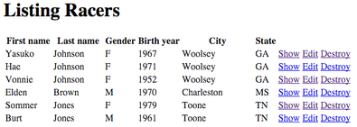

	 [List Racers](docs/rsz_listing_racers.png)

    ```shell
    $ rspec spec/web_resources_spec.rb -e rq01
    ```

2. Implement rails scaffold for `Races`. Use the `index`
page to show a list of all races in descending date order. Use
the remaining controls within the scaffold to be able to create 
new and delete or edit existing races.

    * `name` : String
    * `date` : Date
    * `city` : String
    * `state` : String
    * `swim_distance` : Float
    * `swim_units` : String
    * `bike_distance` : Float
    * `bike_units` : String
    * `run_distance` : Float
    * `run_units` : String

    **Hint**: Use `rails g scaffold_controller` to generate the controller 
    and view pages.

    ```shell
    rails g scaffold_controller Race name date:Date city state swim_distance:Float swim_units \
        bike_distance:Float bike_units: run_distance:Float run_units
    ```

    **Hint**: Remember to update the `config/routes.rb`

    ```ruby
    Rails.application.routes.draw do
      ... 
      resources :races
    ```

    **Hint**: Remember to adjust the query in the controller (`app/controllers/races_controller.rb#index`)
    to provide the required sort order.

    ```ruby
    def index
      @races = Race.all.order_by(...
    end
    ```

    You should have the following URIs, actions, and helper methods in 
    your application at this point. We can add the suffix `_path` to the
    listed helper method prefix as a short-cut to expressing the URI 
    and method to reach the `controller#action` and resulting view. As 
    there is a key helper method we will reference later from the `racers#show`
    and `racers#edit` pages.

    * `race_path(@race)` - used to navigate to individual race results

    ```shell
    $ rake routes | grep races
            races GET    /races(.:format)                    races#index
                  POST   /races(.:format)                    races#create
         new_race GET    /races/new(.:format)                races#new
        edit_race GET    /races/:id/edit(.:format)           races#edit
             race GET    /races/:id(.:format)                races#show
                  PATCH  /races/:id(.:format)                races#update
                  PUT    /races/:id(.:format)                races#update
                  DELETE /races/:id(.:format)                races#destroy
    ```

    You can demonstrate your `Race` registration and CRUD using the 
    [`http://localhost:3000/races`](http://localhost:3000/races) URL.
    (fyi...that would equate to the `races_path` helper method shown above)

    It would be helpful to inspect the controller and view files to 
    see how the scaffold was layered onto your data mode. For example,
    the following snippet shows a look at a `partial` and how it leverages
    the convenience methods to access the swim properties of a race.
    This would have been much tougher to implement had the data tier not
    built a facade for ease of data access.

    ```html
    # app/views/races/_form.html.erb
    <div class="field">
      <%= f.label :swim_distance %><br>
      <%= f.text_field :swim_distance %>
    </div>
    <div class="field">
      <%= f.label :swim_units %><br>
      <%= f.text_field :swim_units %>
    </div>
    ```
    
    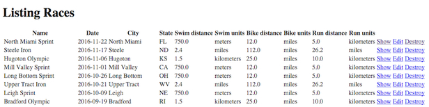
    
    [List Races](docs/rsz_listing_races.jpg)

    ```shell
    $ rspec spec/web_resources_spec.rb -e rq02
    ```
    
3. Update the `races#show` controller and view to display a table of
entrants and their results ordered by overall time (`ASCENDING`), last
name (`ASCENDING`), and first name (`ASCENDING`). That way the results
start out in alphabetical order and switch to time order once results
are added.  Your `races#show` controller action must:

    * define an instance variable called `@entrants` that list all `Entrants`
    for the specific `Race`
    * order the collection of `Entrants` to be by overall time (ascending),
    last name (ascending), and first name (ascending).

    Your `races#show` page must have a table with columns that match those 
indicated in the order given below:

    * column with `Place` - `entrant.overall_place`
    * column with `Time`  - `entrant.secs` formatted as `H:MM:SS`
    * column with `Name` - `entrant.last_name, entrant.first_name`
    * column with `Bib#` - `entrant.bib`
    * column with `City` - `entrant.city`
    * column with `State` - `entrant.state`
    * column with `Gender` - `entrant.racer_gender`
    * column with `Gender Place` - `entrant.gender_place`
    * column with `Group` - `entrant.group_name`
    * column with `Group Place` - `entrant.group_place`
    * column with `Swim` - `entrant.swim_secs` formated as `H:MM:SS`
    * column with `Pace 100` - `entrant.swim_pace_100` formatted as `MM:SS`
    * column with `T1` - `entrant.t1_secs` formatted as `MM:SS`
    * column with `Bike` - `entrant.bike_secs` formated as `H:MM:SS`
    * column with `MPH` - `entrant.bike_mph` format rounded to one (1) decimal place
    * column with `T2` - `entrant.t2_secs` formatted as `MM:SS`
    * column with `Run` - `entrant.run_secs` formated as `H:MM:SS`
    * column with `Min Mile` - `entrant.run_mmile` formatted as `MM:SS`
    * link to the associated `Racer` - `entrant.racer.id` - around the `Name` element
    if they have not been deleted

    **Hint**: Make your data access edits to the controller's show method. The
    `Race` will already have been located and assigned to the `@race`
    attribute by the `set_race` `before_action`.  You must assign the
    collection of `Entrants` to the `@entrants` attribute.  By assigning
    to an instance attribute -- you are making these properties available
    to the view. By forming and ordering the collection in the controller
    -- you are allowing the view to focus on the job of data display
    and not data access. In this specific case we need to query the
    `results` collection directly due to a limitation trying to sort a
    Mongoid collection that already has a default sort order defined
    for `Race.entrants`.

    ```ruby
    # app/controllers/races_controller.rb
    def show
      @entrants=Entrant.where(:"race._id"=>@race.id)....
    end
    def set_race
      @race = Race.find(params[:id])
    end
    ```

    **Hint**: For the view, you can define a helper method to format secs
    in to an H:MM:SS and MM:SS as well as round down the mph decimal
    places when displaying the data.

    ```ruby
    # triresults/app/helpers/application_helper.rb
    module ApplicationHelper
      def format_hours secs
        Time.at(secs).utc.strftime("%k:%M:%S") if secs
      end
      def format_minutes secs
        Time.at(secs).utc.strftime("%M:%S") if secs
      end
      def format_mph mph
        mph.round(1) if mph
      end
    end
    ```

    **Hint**: You can start with the `racers#index` view and make the 
    necessary changes from there.

    * the link to the `racer#show` pages can be obtained using the `racer_path` 
    helper method and passing in the `entrant.racer.id` of the entrant.

    * remember that the relationship from Racer to Entrant.race is set 
    to `:nullify` if the racer is deleted from the database so entrant.race.id
    can be nil.
    
    ```ruby
    has_many :races, ... dependent: :nullify
    ```

    ```ruby
    # triresults/app/views/races/show.html.erb
    <%= link_to 'Back', races_path %>
    </p><strong>Results:</strong>
    <table>
      <thead>
        <tr>
          <th>Place</th>
          <th>Time</th>
          <th>Name</th>
          ...
          <th>Run</th>
          <th>Min Mile</th>
          <th colspan="3"></th>
        </tr>
      </thead>

      <tbody>
        <% @entrants.each do |entrant| %>
          <tr>
            <td><%= entrant.overall_place %></td>
            <td><%= format_hours entrant.secs %></td>
            <% if entrant.racer.id %>
              <td><%= link_to "#{entrant.last_name}, #{entrant.first_name}", racer_path(entrant.racer.id) %></td>
            <% else %>
              <td><%= "#{entrant.last_name}, #{entrant.first_name}" %></td>
            <% end %>
            ...
            <td><%= format_hours entrant.run_secs %></td>
            <td><%= format_minutes entrant.run_mmile %></td>
          </tr>
        <% end %>
      </tbody>
    </table>
    ```

    You should now be able to see a list of entrants for a race and be
    able to navigate to the show page for each entrant to see their
    more detailed results.  If you navigate to a historical race,
    the results will be in ascending time order. If you navigate to an
    upcoming race without finish times -- the page will be ordered by
    last/first name ascending.  You should be able to navigate from the
    result to the show page for the specific `Racer` using the link
    on name.

	 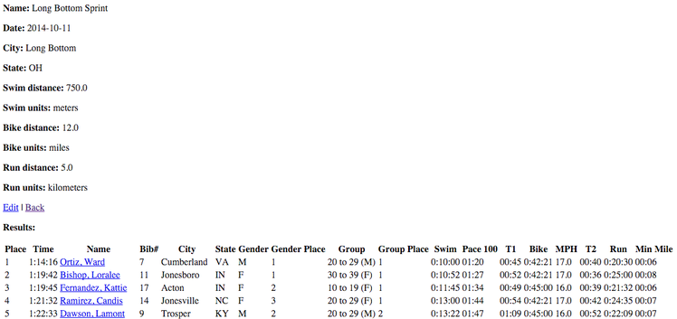
	 
	 [Show Race Entrants](docs/rsz_races_show.png)

    ```shell
    $ rspec spec/web_resources_spec.rb -e rq03
    ```

4. Update the `racers#show` view to display a table of all races the
racer has registered for in descending time order.  Your `racers#show`
controller action must:

    * define an instance variable called @races that list all `Entrants`
    for the specific `Racer`
    * order the collection of `Entrants` to be by race date (descending)
    (**Hint**: this is the default sort order for the racer.races collection)

    Your `racers#show` page should have a table with:

    * column with `Name` - `entry.race_name`
    * column with `Date` - `entry.race_date`
    * column with `Overall` - `entry.overall.place`
    * column with `Gender` - `entry.gender.place`
    * column with `Group` - `entry.group.place`
    * link to `Results` - `race_path(race)`

    **Hint**: You can use the controller show method to define the collection
    of `Entrants` for `Races` to display. This collection is ordered, by default,
    in descending time order.

    ```ruby
      def show
        @races=@racer.races
      end
    ```
    
    **Hint**: You can start with a copy of the table from the `races#show` view
    (`app/views/races/index.html.erb`) and make changes from there.

    ```html 
    # app/views/racers/show.html.erb
    <%= link_to 'Back', racers_path %>
    </p>
    <strong>Races:</strong>
    <table>
      <thead>
        <tr>
          <th>Name</th>
          <th>Date</th>
          ...
          <th>Overall Place</th>
          <th>Gender Place</th>
          <th>Group Place</th>
          <th colspan="3"></th>
        </tr>
      </thead>

      <tbody>
        <% @racer.races.each do |entry| %>
          <tr>
            <td><%= entry.race_name %></td>
            <td><%= entry.race_date %></td>
            ...
            <td><%= entry.overall_place %></td>
            <td><%= entry.gender_place %></td>
            <td><%= entry.group_place %></td>
            <td><%= link_to 'Results', race_path(entry.race) %></td>
          </tr>
        <% end %>
      </tbody>
    <table>
    ```

    At this point, you should be able to see the races that the specific 
    racer has registered for, ordered in date descending order with 
    race results. Historical results will have placings. Upcoming races
    will not. You should be able to navigate from the result to the show
    page for the specific `Race` using the `Results` link.
    
    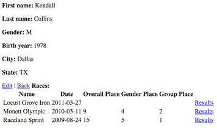
    
	 [Racer Race Results](docs/rsz_show_racer_results.png)

    ```shell
    $ rspec spec/web_resources_spec.rb -e rq04
    ```

5. Update the `racers#edit` action and resulting view (a partial) to
display a table of available upcoming races the racer has not already
registered for.  The controller action for `racers#edit` must:

    * obtain a collection to the upcoming races the `Racer`
    has not registered for
    * order the collection in time order, descending

    The view for `racers#edit` must display a table with the 
    following data in the following following order when the `Racer` is 
    persisted and the partial is being used for edit mode:

    * column with `Name` - `race.name`
    * column with `Date` - `race.date`
    * column with `City` - `race.city`
    * column with `State` - `race.state`
    * column with `Swim` - `race.swim_distance`
    * column with `units` - `race.swim_units`
    * column with `Bike` - `race.bike_distance`
    * column with `units` - `race.bike_units`
    * column with `Run` - `race.run_distance`
    * column with `units` - `race.run_units`

    **Hint**: Remember you can get a criteria of `upcoming_available_to`
    races that can be extended with and `order_by` to have to soonest
    races ordered to the top of the page.

    ```ruby
    # app/controllers/racers_controller.rb 
    def edit
      @races=Race.upcoming_available_to(@racer).order_by(:date.asc)
    end
    ```

    **Hint**: The view is in `triresults/app/views/racers/_form.html.erb`
    and a test of whether we are in edit or create mode can be 
    accomplished using `@racer.persisted?`.

    ```html
    # triresults/app/views/racers/_form.html.erb
    <% if @racer.persisted? %>
      <table>
        <thead>
          <tr>
            <th>Name</th>
            <th>Date</th>
            <th>City</th>
          ...
            <th>Run</th>
            <th>Units</th>
            <th colspan="3"></th>
          </tr>
        </thead>

        <tbody>
          <% @races.each do |race| %>
            <tr>
              <td><%= race.name %></td>
              <td><%= race.date %></td>
              <td><%= race.city %></td>
          ...
              <td><%= race.run_distance %></td>
              <td><%= race.run_units %></td>
            </tr>
          <% end %>
        </tbody>
      </table>
    <% end %>
    ```

    At this point you should be able to see available races when attempting
    to edit a racer. The `Register` link shown in the diagram will be added
    in the next section.
    
    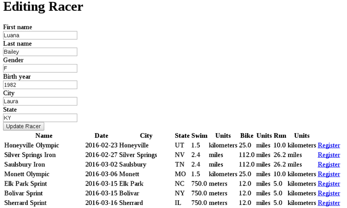
    
	 [Available Races](docs/rsz_edit_racer_register_races.png)
	 
    ```shell
    $ rspec spec/web_resources_spec.rb -e rq05
    ```

### Web Racer/Race Registration

In this section you will implement the ability to register a `Racer` for
a `Race` from the `racers#edit` page. This will involve the creation of
a nested `Entrant` resource that can perform the work and a link from
the page to trigger the work. Registration will be a single click and 
we will not implement the cancellation of registrations as part of this
assignment.

1. Add a nested `entries` resource below the `racers` resource 
within `config/routes.rb`. Restrict functionality at this point 
to a `POST` and map it to a `create_entry` action method within `racers`
controller.

    **Hint**: 

    ```ruby
    Rails.application.routes.draw do
      resources :racers do
        post "entries" => "racers#create_entry"
      end
    ```

    This should produce the following route within your application and 
    we will use the action to create a new entry for the racer.

    ```shell
    $ rake routes | grep entries
    racer_entries POST   /racers/:racer_id/entries(.:format) racers#create_entry
    ```
      
    * `racer_entry` is the helper method prefix for `racer_entry_path`, which
  	 we can use to reference this URI when calling it
    * `:racer_id` is the `_id` of the racer we are referencing


    ```shell
    $ rspec spec/web_registration_spec.rb -e rq01
    ```

2. Add a method to the `racers` controller called `create_entry` that:

    * finds the `Racer` based on a `params[:racer_id]`
    * finds the `Race` based on `params[:race_id]`
    * uses the `Race.create_entrant` class method to create an `Entrant`
    * re-directs the `racer#show` page with a status of the registration passed in the 
      flash `notice`

    **Hint**:

    ```ruby
    # triresults/app/controllers/racers_controller.rb
      # POST /racers/1/entries?race_id=1
      def create_entry
        @racer=Racer.find(params[:racer_id]) 
        @race=Race.find(params[:race_id]) 
        @entrant=@race.create_entrant @racer

        respond_to do |format|
          if @entrant.valid?
            format.html { redirect_to @racer, notice: 'Race entry was successfully created.' }
            format.json { render :show, status: :created, location: @racer }
          else
            format.html { redirect_to @racer, notice: "Invalid registration #{@entrant.errors.messages}" }
            format.json { render json: @entrant.errors, status: :unprocessable_entity }
          end
        end
      end
    ```

    ```shell
    $ rspec spec/web_registration_spec.rb -e rq02
    ```

3. Add a `Register` link from the table of upcoming and available races on 
the `racers#edit` view page. This link must

    * issue a `POST` to the `racer_entries_path`
    * pass the `racer_id` and `race_id` parameters to the controller

    **Hint**: You are just adding a link within your existing table rows
    and having it navigate to the new controller action to complete 
    the registration.

    ```html
    # app/views/racers/_form.html.erb
    <%= form_for(@racer) do |f| %>
      ...
      <tbody>
        <% @races.each do |race| %>
          <tr>
          ...
            <td><%= race.run_distance %></td>
            <td><%= race.run_units %></td>
            <td><%= link_to 'Register', racer_entries_path(@racer, :race_id=>race.id), method: :post %></td>
          </tr>
        <% end %>
      </tbody>
    </table>
    ```

    At this point one should be able to register any valid `Racer` with a `Race`.
    You can see the newly created race `Entry` added to the `Races` table on the `racers#show` page.
    You can see the newly created race `Entry` added to the `Results` table on the on the `races#show` page.
    
    
    
    [Register Racer](docs/rsz_edit_racer_register_races.png)

    ```shell
    $ rspec spec/web_registration_spec.rb -e rq03
    ```

### (Optional/Not Graded) Deploy to Heroku

After completing the assignment and submitting for grading, optionally
deploy your application to Heroku using the base name of `triresults`
followed by a unique five (5) digit number that you chose.

### (Optional/Not Graded) Extensions

After completing the assignment and submitting for grading, optionally

  * change the ordering of races so that they are ordered from closest to 
  farthest from the racer's residence.
  * locate the racer who has come the farthest to participate

All the required data is in place in the sample data. You just need 
to add a geolocation index to the racer's residence and race's location
coordinates.

## Self Grading/Feedback

Some unit tests have been provided in the bootstrap files and provide 
examples of tests the grader will be evaluating for when you submit 
your solution. They must be run from the project root directory.

```shell
$ rspec (file)
...
(N) examples, 0 failures
```

You can run as many specific tests you wish be adding `-e rq## -e rq##`
```shell
$ rspec (file) -e rq01 -e rq02
```

## Submission

Submit an .zip archive (other archive forms not currently supported)
with your solution root directory as the top-level (e.g., your Gemfile
and sibling files must be in the root of the archive and *not* in a
sub-folder.  The grader will replace the spec files with fresh copies
and will perform a test with different query terms.

```text
|-- app
|   |-- assets
|   |-- controllers
|   |-- helpers
|   |-- mailers
|   |-- models
|   `-- views
|-- bin
|-- config
|-- config.ru
|-- db
|-- Gemfile
|-- Gemfile.lock
|-- lib
|-- log
|-- public
|-- Rakefile
|-- README.rdoc
|-- test
`-- vendor
```

#### Last Updated: 2016-08-23
