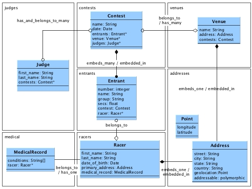

# Module 3, Lesson 2: Mongoid Relationships

The overall goal of the assignment is to give you practice in:

  * Defining models, custom type classes, and relationships
  * Defining relationship cardinality (one and many), realization (embedded and linked), and 
  navigation types (uni and bi-directional)
  * Forming and manipulating relationships

The functional goal of the assignment is to:

  * Implement a data tier for managing `Contest` information to include the following document types:
    *  `Venue`, `Judge`, `MedicalRecord`, and `Racer`

**Note** that this assignment was written so that you can implement it
in parts after each lecture. If you are performing the assignment in
between lectures, stop at the next lecture boundary in the technical
requirements section and resume once you have completed the lecture. You
are free to experiment with other forms of the configurations presented,
but the grading will only be targeted at the specific requirements listed.

## Functional Requirements



* **Diagram Notes**: 
	* [Model/Relationships Image](./module3-relationships.jpg)
	* (*) represents a foreign key
	* the upper left-hand names in each boundary box represents the corresponding collection 	names within MongoDB

1. Implement a (custom type) `Point` that encapsulates the geographic
coordinates of an `Address`.

2. Implement a (1:1 embedded) relationship between `Racer`/`Venue` and `Address`.

3. Implement a (1:M linked) relationship between `Venue` and `Contest`
and an embedded linked relationship between `Entrant` and `Racer`.

4. Implement a (1:M embedded) relationship between `Contest` and `Entrant`.

5. Implement a (1:1 Linked) relationship between `Racer` and `MedicalRecord`.

6. Implement a (M:M Linked) relationship between `Judge` and `Contest`.

## Getting Started

1. Start your MongoDB server using `mongod`

2. Create a new Rails application called `contests`.

    ```shell
    $ rails new contests
    $ cd contests
    ```

3. Setup your application for Mongoid.

    * Add the `mongoid`, `rspec-rails`, and `mongoid-rspec` gems to your Gemfile and run 	 `bundle`. Notice that the `:test` group encapsulates the two related `rspec` gems.
    
    	```ruby
    	gem 'mongoid', '~> 5.0.0'
    	
    	group :test do
    		gem 'rspec-rails', '~> 3.0'
    		gem 'mongoid-rspec', '3.0.0'
    	end
    	```
    	
    * Generate a `mongoid.yml` configuration file
    	
    	```bash
    	$ rails g mongoid:config
    		create config/mongoid.yml
    	```
    	
    * Add the generated `mongoid.yml` file to `config/application.rb`
		
		```ruby
		module Contests
			class Application < Rails::Application
			...
			# Boostraps mongoid within applications -- like rails console
			Mongoid.load!('./config/mongoid.yml')
		```
    

4. Download and extract the starter set of files. The root
directory of this starter set will be referred to as the root directory
of your solution. When extracted correctly -- the `spec` folder
should be at the same (root) level.

    ```text
    --- student-start  
        |-- .rspec (important hidden file)
        `-- spec
            |-- test_utils.rb
            |-- customtype_spec.rb
            |-- lecture1_spec.rb
            |-- lecture2_spec.rb
            |-- lecture3_spec.rb
            |-- lecture4_spec.rb
            |-- lecture5_spec.rb
            |-- rails_helper.rb
            `-- spec_helper.rb
    ```

    * spec - this directory contains tests to verify your solution. You should
    not modify anything in this directory

5. Implement the technical requirements.

6. Run the rspec command from the project root directory. The spec files 
are written per-lecture. The steps taken in one lecture can impact the results
of a preceding lecture. However, if you execute all sections correctly, you will be 
able to execute all rspec tests at the end and pass.

    ```shell
    $ rspec

    (N) examples, (N) failures
    ...
    ```
    
## Technical Requirements

### Setup: Custom Type

In this section we will perform some catch-up and implement a custom type described
in Lesson 1. Custom types have structure but no `_id`. They are used as a convenience
for handling fields and marshaling/de-marshaling those fields. Otherwise your
application code can work directly with hashes.

1. Add a custom type called `Point` (in the `app/model` directory) that represents the longitude and
latitude coordinates for an `Address` expressed in `GeoJSON` format. This class must:

    * be called `Point`
    * have a read/write attribute called `longitude`
    * have a read/write attribute called `latitude`
    * have an initializer that accepts the two attribute values in the
    order of `longitude` and `latitude`

    You can use the rails console to demonstrate your new class and initializer method.

    ```ruby
     > Point.new(0,1)
      => #<Point:0x000000053e69d0 @longitude=0, @latitude=1> 
    ```

    ```shell
    $ rspec spec/customtype_spec.rb -e rq01
    ```

2. Add an instance method to the `Point` class called `mongoize` that
returns a hash in `GeoJSON Point` format and ready to be stored within MongoDB. 
An instance method by this name is required by Mongoid for use of custom types.
This method must:

    * accept no arguments
    * return a hash with a 
        - key `type` with the String value `"Point"` and 
        - key `coordinates` with an array containing `longitude` and `latitude` in that order.

    You can use the rails console to demonstrate your new instance method.

    ```ruby
      > Point.new(0,1).mongoize
       => {:type=>"Point", :coordinates=>[0, 1]} 
    ```

    ```shell
    $ rspec spec/customtype_spec.rb -e rq02
    ```

3. Add a class method called `demongoize` that will return an instance
of the `Point` class initialized from the contents in the database. 
A class method by this name is required by Mongoid for custom types.
This method must:

    * accept a hash object assumed to be the result of the `mongoize` method
    * extract the `longitude` and `latitude` from the `coordinates` array in the hash
    * instantiate a new Point instance with the `longitude` and `latitude`
    * return the new Point instance

    You can use the rails console to demonstrate your new class method.

    ```ruby
    > Point.demongoize(:type=>"Point", :coordinates=>[0, 1])
     => #<Point:0x0000000538e7a8 @longitude=0, @latitude=1>
    ```

    ```shell
    $ rspec spec/customtype_spec.rb -e rq03
    ```

4. Add a class method called `mongoize` that will accept either `Point` or hash types
and return a `mongoized` string for either inputs. A class method by this name is required 
by Mongoid for custom types. This method must:

    * accept a single input
    * determine the type of the input
    * create a `mongoized` form of the `Point` ready to be store in MongoDB.

    You can use the rails console to demonstrate your new class method.

    ```ruby
     > Point.mongoize(Point.new(0,1))
      => {:type=>"Point", :coordinates=>[0, 1]} 
     > Point.mongoize(:type=>"Point", :coordinates=>[0, 1])
      => {:type=>"Point", :coordinates=>[0, 1]}
    ```

    ```shell
    $ rspec spec/customtype_spec.rb -e rq04
    ```

5. Add a class method called `evolve` that performs the same functionality as `mongoize`.
A class method by this name is required by Mongoid for custom types.

    You can use the rails console to demonstrate your new class method.

    ```ruby
     > Point.evolve(Point.new(0,1))
      => {:type=>"Point", :coordinates=>[0, 1]} 
     > Point.evolve(:type=>"Point", :coordinates=>[0, 1])
      => {:type=>"Point", :coordinates=>[0, 1]}
    ```

    ```shell
    $ rspec spec/customtype_spec.rb -e rq05
    ```

6. Use the `rails generate` to create a model class called `Address` with the following fields:

    * `street` : String
    * `city` : String
    * `state` : String
    * `country` : String
    * `geolocation` : Point

    You can use the rails console to demonstrate your new model class with
    the embedded custom type.

    ```ruby
    > Address.create(:geolocation=>Point.new(0,1))          
     => #<Address _id: 5675f08de301d0a1fb000000, 
       street: nil, city: nil, state: nil, country: nil, 
       geolocation: {:type=>"Point", :coordinates=>[0, 1]}> 

    > Address.collection.find.first
     => {"_id"=>BSON::ObjectId('5675f08de301d0a1f    Can navigate from Racer to Address (FAILED - 2)
b000000'), 
       "geolocation"=>{"type"=>"Point", "coordinates"=>[0, 1]}}

    > Address.first.geolocation
     => #<Point:0x000000047aee10 @longitude=0, @latitude=1> 
    ```

    ```shell
    $ rspec spec/customtype_spec.rb
    ```

### Lecture 1: 1:1 Embedded

In this section we will build a 1:1 embedded relationship between `Racer`/`Venue`
and `Address`. We will start with just `Racer` and `Address` and build a concrete
1:1 embedded relationship. It will eventually evolve to a 1:1 embedded polymorphic relationship 
since Address is not specific to `Racer`.

1. Use the `rails generate` to create a model class called `Racer` with the following fields:

    * `first_name` : String -- mapped to the document field `fn`
    * `last_name` : String -- mapped to the document field `ln`
    * `date_of_birth` : Date -- mapped to the document field `dob`

    You can use the rails console to demonstrate your new model class,
    fields, and field mappings.

    ```ruby
    > Racer.new
     => #<Racer _id: 5675fb8ae301d0a1fb000002, 
       first_name(fn): nil, last_name(ln): nil, date_of_birth(dob): nil>
    ```

    ```shell
    $ rspec spec/lecture1_spec.rb -e rq01
    ```

2. Define a 1:1 uni-directional, embeded relationship from `Racer` to
`Address` using the `embeds_one` macro. (**Hint**: Since the relationship name
`primary_address` is different from the classname `Address`, you must
specify a `class_name` mapping). This relationship must:

    * be called `primary_address`
    * embed the `Address` instance within the body of the `Racer`

    You can use the rails console to demonstrate your new relationship.
    In the example below, we are forming the relationship at the point where 
    query is executed.

    ```ruby
    > address=Address.new(:city=>"somewhere", :geolocation=>Point.new(0,1))
     => #<Address _id: 5675fedfe301d0a1fb000003, street: nil, city: "somewhere", 
       state: nil, country: nil, geolocation: {:type=>"Point", :coordinates=>[0, 1]}> 
    > r=Racer.create(:fn=>"cat",:ln=>"inhat",:primary_address=>address)
     => #<Racer _id: 5675ff11e301d0a1fb000004, 
       first_name(fn): "cat", last_name(ln): "inhat", date_of_birth(dob): nil> 
    ```

    **Note** the `Address` instance is embedded within the `Racer` instance.

    ```ruby
    > pp r.attributes
    {"_id"=>BSON::ObjectId('5675ff11e301d0a1fb000004'),
     "first_name"=>"cat",
     "last_name"=>"inhat",
     "primary_address"=>
      {"_id"=>BSON::ObjectId('5675fedfe301d0a1fb000003'),
       "city"=>"somewhere",
       "geolocation"=>{:type=>"Point", :coordinates=>[0, 1]}}}
    ```

    Notice that you can navigate from the `Racer` to the `Address` fields.
    Since this is currently uni-directional, we cannot navigate from the 
    `Address` instance to the containing `Racer` instance.

    ```ruby
    > r.first_name
     => "cat" 
    > r.primary_address.city
     => "somewhere" 
    > r.primary_address.geolocation
     => #<Point:0x00000004ffe818 @longitude=0, @latitude=1> 
    ```

    ```shell
    $ rspec spec/lecture1_spec.rb -e rq02
    ```

3. Define a 1:1 concrete relationship in the reverse direction from `Address` to `Racer`
using the `embedded_in` macro. This relationship must:

    * be called `racer` and be specific to `Racer` (i.e., we are not yet 
    worried about Venue at this point)

    You can demonstrate your new bi-directional relationship by navigating 
    back and forth between the `Racer` and `Address`.
    
    ```ruby
    > r=Racer.where(:fn=>"cat",:ln=>"inhat").first
     => #<Racer _id: 5675ff11e301d0a1fb000004, 
       first_name(fn): "cat", last_name(ln): "inhat", date_of_birth(dob): nil> 
    > address=r.primary_address
    > address.racer
     => #<Racer _id: 5675ff11e301d0a1fb000004, 
       first_name(fn): "cat", last_name(ln): "inhat", date_of_birth(dob): nil>
    ```

    ```shell
    $ rspec spec/lecture1_spec.rb -e rq03
    ```

4. Generalize the 1:1 concrete relationship using a polymorphic construct
such that any model class can also embed `Address` instance(s). The `Address`
class must

    * change the name of the relationship from `racer` to `addressable`
    * annotate the relationship as being `polymorphic`

    The `Racer` class must:

    * annotate the relationship on its end as `addressable`

    You may use the rails console to repeat the actions of the previous
    step to demonstrate your new polymorphic relationship.

    ```ruby
    > r=Racer.where(:fn=>"cat",:ln=>"inhat").first
    > address=r.primary_address
    > address.addressable
     => #<Racer _id: 5675ff11e301d0a1fb000004, 
       first_name(fn): "cat", last_name(ln): "inhat", date_of_birth(dob): nil> 
    ```

    ```shell
    $ rspec spec/lecture1_spec.rb -e rq04
    ```

5. Use the `rails generate` command to create a model class called `Venue` with the following fields:

    * `name` : String

    You can use the rails console to demonstrate your new model class.
  
    ```ruby
    > Venue.new
     => #<Venue _id: 56760a1ce301d0a1fb000005, name: nil>
    ```

    ```shell
    $ rspec spec/lecture1_spec.rb -e rq05
    ```

6. Create a 1:1 embedded relationship between `Venue` and `Address` using the now
polymorphic `addressable` relationship. This relationship must:

    * be called `address`
    * embed an instance of `Address` within `Venue` instances
    * annotate the relationship as `addressable` 

    You can demonstrate your new relationship using the rails console. If you inspect
    the `Venue` class for methods containing the word `address` 
    (**Hint**: `Venue.methods.grep /address/`) you can locate alternatives for creating the 
    relationship.

    ```ruby
    > v=Venue.create(:name=>"Boston")
     => #<Venue _id: 56760ddbe301d0a1fb00000a, name: "Boston"> 
    > Venue.find_by(:name=>"Boston").attributes
     => {"_id"=>BSON::ObjectId('56760ddbe301d0a1fb00000a'), "name"=>"Boston"} 

    > v.create_address(:city=>"Boston", :state=>"MA", :geolocation=>Point.new(71.5,42.21))
     => #<Address _id: 56760de9e301d0a1fb00000b, street: nil, city: "Boston", state: "MA", 
       country: nil, geolocation: {:type=>"Point", :coordinates=>[71.5, 42.21]}> 
    > pp Venue.find_by(:name=>"Boston").attributes
    {"_id"=>BSON::ObjectId('56760ddbe301d0a1fb00000a'),
     "name"=>"Boston",
     "address"=>
      {"_id"=>BSON::ObjectId('56760de9e301d0a1fb00000b'),
       "city"=>"Boston",
       "state"=>"MA",
       "geolocation"=>{"type"=>"Point", "coordinates"=>[71.5, 42.21]}}}

    > v.address.addressable
     => #<Venue _id: 56760ddbe301d0a1fb00000a, name: "Boston">
    ```

    **Note** that setting the `address` to `nil` removes the `Address` 
    from the `Venue` document.

    ```ruby
    > v.address=nil
     => nil 
    > pp Venue.find_by(:name=>"Boston").attributes
    {"_id"=>BSON::ObjectId('56760ddbe301d0a1fb00000a'), "name"=>"Boston"}
    ```

    ```shell
    $ rspec spec/lecture1_spec.rb -e rq06
    ```

### Lecture 2: 1:M Linked

In this section you will be asked to create a few examples of 1:M linked relationships.
The first one between `Contest` and `Venue` will be straight forward. The second one between
`Entrant` and `Racer` will be complicated by `Entrant` becoming an embedded type in the 
next section.

1. Use the `rails generate` command to create a model class called `Contest` with the following fields:

    * `name` : String
    * `date` : Date

    Also add:

    * a mixin to track updates, but not creates (**Hint**: `Mongoid::Timestamps::Updated`)

    You can use the rails console to demonstrate your new model class,
    fields, and field mappings.

    ```ruby
    > Contest.new
     => #<Contest _id: 56761701e301d0a1fb00000c, updated_at: nil, name: nil, date: nil> 
    ```

    ```shell
    $ rspec spec/lecture2_spec.rb -e rq01
    ```

2. Create a M:1 linked, uni-directional relationship from `Contest` to `Venue` using 
the `belongs_to` macro. This relationship must:

    * be called `venue`
    * form a foreign key link from the `Contest` to the `Venue`

    You can use the rails console to demonstrate your new M:1 uni-directional
    relationship.

    ```ruby
    > v=Venue.find_by(:name=>"Boston")
     => #<Venue _id: 56760ddbe301d0a1fb00000a, name: "Boston"> 
    > c=Contest.create(:name=>"Boston 5K", :date=>Date.new(2015,5,30))
    > pp Contest.find_by(:name=>"Boston 5K").attributes
    {"_id"=>BSON::ObjectId('56761944e301d0a1fb00000d'), 
     "name"=>"Boston 5K", 
     "date"=>2015-05-30 00:00:00 UTC, 
     "updated_at"=>2015-12-20 02:58:12 UTC}
    ```

    Notice that when you asssign the `Venue` to the `Contest`
    and save the `Contest`, the foreign key to the `Venue` is 
    written into the `Contest` instance.

    ```ruby
    > c.venue = v
     => #<Venue _id: 56760ddbe301d0a1fb00000a, name: "Boston"> 
    > c.save
    > pp Contest.find_by(:name=>"Boston 5K").attributes
    {"_id"=>BSON::ObjectId('56761944e301d0a1fb00000d'),
     "name"=>"Boston 5K",
     "date"=>2015-05-30 00:00:00 UTC,
     "updated_at"=>2015-12-20 03:02:00 UTC,
     "venue_id"=>BSON::ObjectId('56760ddbe301d0a1fb00000a')}
    ```

    Notice that if you reset the state of the in-memory instances and 
    access the `Contest` again, the `Venue` is not accessed.

    ```ruby
    > reload!

    > c=Contest.find_by(:name=>"Boston 5K")
    D, | {"find"=>"contests", "filter"=>{"name"=>"Boston 5K"}}
     => #<Contest _id: 56761944e301d0a1fb00000d, updated_arailst: 2015-12-20 03:02:00 UTC, name: "Boston 5K", ...
    ```

    We can even access the `_id` of the `Venue` from the `Contest` without 
    loading the `Venue`. This is because Mongoid gives us direct access to the 
    foreign key property.

    ```ruby
    > c.venue_id
     => BSON::ObjectId('56760ddbe301d0a1fb00000a') 
    ```
    
    However, if we cross the relationship -- the `Venue` is loaded.

    ```ruby
    > c.venue.id
    D, | {"find"=>"venues", "filter"=>{"_id"=>BSON::ObjectId('56760ddbe301d0a1fb00000a')}}
     => BSON::ObjectId('56760ddbe301d0a1fb00000a') 
    ```

    ```shell
    $ rspec spec/lecture2_spec.rb -e rq02
    ```

3. Implement the inverse side of the M:1 relationship from `Venue` to `Contest` using the
`has_many` macro. This does not add a foreign key local to `Venue`. It causes `Venue` to search
for `Contest`s with its primary key listed as a foreign key. The relationship must:

    * be called `contests`

    You can demonstrate your new 1:M inverse relationship using the rails console. Pay 
    close attention to the debug printed (and not printed) by the driver. We start by 
    getting a `Contest` with an association with a `Venue` to obtain the primary key 
    for the `Venue`.

    ```ruby
    > reload!
    > c=Contest.find_by(:name=>"Boston 5K")
    > vid=c.venue_id
    ```

    When we access the `Venue` via the find method, the `venues` collection is searched for 
    documents with a primary key (`_id`) equal to our value.

    ```ruby
    > v=Venue.find(vid)
    D, | {"find"=>"venues", "filter"=>{"_id"=>BSON::ObjectId('56760ddbe301d0a1fb00000a')}}
     => #<Venue _id: 56760ddbe301d0a1fb00000a, name: "Boston"> 
    ```

    When we access the `Contest`s via the `venue.contests` method, the `contests` collection 
    is searched for foreign keys (`venue_id`) equal to our value.

    ```ruby
    > v.contests.map {|c| c.name}
    D, | {"find"=>"contests", "filter"=>{"venue_id"=>BSON::ObjectId('56760ddbe301d0a1fb00000a')}}
     => ["Boston 5K"] 
    ```
  
    Prior to removing the relationship, we can check the state of the database 
    and see the foreign key in the `Contest` collection.

    ```ruby
    > pp c.attributes
    {"_id"=>BSON::ObjectId('56761944e301d0a1fb00000d'),
     "name"=>"Boston 5K",
     "date"=>2015-05-30 00:00:00 UTC,
     "updated_at"=>2015-12-20 03:02:00 UTC,
     "venue_id"=>BSON::ObjectId('56760ddbe301d0a1fb00000a')}
    ```

    When we remove the `Contest` (many-side) from the `Venue` (one/inverse-side) side of the 
    bi-directional relationship, the foreign key in the `Contest` is updated along with the 
    `updated_at` timestamp.

    ```ruby
    > v.contests.delete c
    D, | {"update"=>"contests", "updates"=>[{"q"=>{"_id"=>BSON::ObjectId('56761944e301d0a1fb00000d')}, 
      "u"=>{"$set"=>{"venue_id"=>nil, "updated_at"=>2015-12-20 03:29:54 UTC}}...
    ```

    We are left with a `nil` foreign key in the `Contest` with an updated `updated_at` timestamp.

    ```ruby
    > pp Contest.find(c.id).attributes
    {"_id"=>BSON::ObjectId('56761944e301d0a1fb00000d'),
     "name"=>"Boston 5K",
     "date"=>2015-05-30 00:00:00 UTC,
     "updated_at"=>2015-12-20 03:29:54 UTC,
     "venue_id"=>nil}
    ```

    Further accesses for `Contest` instances for the `Venue` come up empty.

    ```ruby
    > v.contests.map {|c| c.name}
     => [] 
    ```

    ```shell
    $ rspec spec/lecture2_spec.rb -e rq03
    ```

4.  Use the `rails generate` command to create a model class called `Entrant` with the following fields:

    * `_id` : Integer -- assigned to hold the `number` of the entrant
    * `name` : String -- cached name of the `Racer`
    * `group` : String
    * `secs` : Float

    You can demonstrate your new model class using the rails console.

    ```ruby
    > Entrant.new(:id=>1)
     => #<Entrant _id: 1, name: nil, group: nil, secs: nil>
    ```

    ```shell
    $ rspec spec/lecture2_spec.rb -e rq04
    ```

5. Add a M:1 uni-directional, linked relationship from `Entrant` to `Racer` using the `belongs_to` 
macro. This relationship must:

    * be called `racer`
    * copy the name of the `Racer` (by concatenating "last, first"
    names separated by a comma, into a single string) when the instance
    is created. (Hint: `before_create` callback).

    You can demonstrate your new relationship using the rails console. When we associate a 
    new `Entrant` with a `Racer` instance, only the primary key of the `Racer` is stored.

    ```ruby
    > racer=Racer.find_by(:fn=>"cat",:ln=>"inhat")
    > entrant=Entrant.new(:id=>1, :racer=>racer, :group=>"masters")
     => #<Entrant _id: 1, name: nil, group: "masters", secs: nil, 
       racer_id: BSON::ObjectId('5675ff11e301d0a1fb000004')> 
    ```

    However, when the `Entrant` is saved, the `before_create` callback is invoked, 
    where the `Entrant` has a chance to copy off the `Racer`'s first/last name into 
    a field within the `Entrant` document. It is assumed that `Entrant`s never 
    change `Racer` instances and `Racer` names rarely change. However, it is also assumed
    that the `Racer` name will be needed in `Contest` race results.

    ```ruby
    > entrant.save
    D, | {"insert"=>"entrants", "documents"=>[{"_id"=>1, "group"=>"masters", 
      "racer_id"=>BSON::ObjectId('5675ff11e301d0a1fb000004'), "name"=>"inhat, cat"}]
    ```

    **Note** that the name of the `Racer` can be obtained from the cached 
    copy within the `Entrant`.

    ```ruby
    > entrant.name
     => "inhat, cat" 
    ```

    ```shell
    $ rspec spec/lecture2_spec.rb -e rq05
    ```

6. Implement the inverse side of the M:1 linked relationship from `Racer` to `Entrant` 
using the `has_many` macro. This will be a temporary construct because in the next section
we will be changing `Entrant` to an embedded class and will need to do something different.
For now, this relationship must:

    * be called `races` (**Hint**: this relationship must also be mapped to the `Entrant` class
    since the name `Entrant` and the singular form of `races` is not the same.

    You can demonstrate your new bi-directional relationship using the rails console.
    Notice if more `Entrant` associations are made with `Racer` -- they are all located 
    using a single foreign key query.

    ```ruby
    > (2..3).each {|index| Entrant.create(:id=>index, :racer=>racer)}
    > racer.races.map {|r| r.id}
    D, | {"find"=>"entrants", 
      "filter"=>{"racer_id"=>BSON::ObjectId('5675ff11e301d0a1fb000004')}}
     => [2, 3] 
    ```

    ```shell
    $ rspec spec/lecture2_spec.rb -e rq06
    ```

### Lecture 3: 1:M Embedded

In this section you will focus on implementing a 1:M embedded relationship.
In this case, the embedded document will be an "annotated link" from `Contest`
to `Racer` augmented with racer-specific information for the contest using an
`Entrant` class.

1. Create an 1:M, uni-directional embedded relationship from `Contest` to `Entrant`
using the `embeds_many` macro. This relationship must:

    * be called `entrants`

    You can demonstrate your new relationship using the rails
    console. However, until we make this a bi-directional relationship
    there will not be much you can do with the relationship.

    ```ruby
    > Contest.new.entrants 
     => [] 
    ```

    ```shell
    $ rspec spec/lecture3_spec.rb -e rq01
    ```

2. Complete the M:1, bi-directional embedded relationship from `Entrant` to `Contest`
using the `embedded_in` macro. This relationship must:

    * be called `contest`

    You can demonstrate your new relationship using the rails console. 

    ```ruby
    > Entrant.new.embedded?
     => true 
    > Entrant.new.contest
     => nil 
    ```

    However, we soon will see that embedding `Entrant` within `Contest`
    causes a problem with the inverse side of the 1:M relationship from
    `Racer` to `Entrant'.

    ```ruby
    > racer=Racer.find_by(:fn=>"cat",:ln=>"inhat")
    > racer.races
      Mongoid::Errors::MixedRelations: 
      message:
        Referencing a(n) Entrant document from the Racer document via
        a relational association is not allowed since the Entrant is
        embedded.
      summary:
        In order to properly access a(n) Entrant from Racer the reference
        would need to go through the root document of Entrant. In a simple
        case this would require Mongoid to store an extra foreign key
        for the root, in more complex cases where Entrant is multiple
        levels deep a key would need to be stored for each parent up
        the hierarchy.
      resolution:
        Consider not embedding Entrant, or do the key storage and access
        in a custom manner in the application code.
    ```

    **Note** that many of the previous rspec tests that succeeded will now fail as 
    the result of the current state detailed above.  This will be repaired in the next step.

    ```shell
    $ rspec spec/lecture3_spec.rb -e rq02
    ```

3. Modify the M:1 relationship from `Entrant` to `Racer` to be uni-directional
again, thus only directly navigatable from the embedded `Entrant` owning side.
We will provide an alternative once we get finished with the other relationship
started in this section.

    You can demonstrate that the relationship is again uni-directional
    using the rails console. We can navigate from the `Entrant` to the 
    `Racer` but no longer have a way to navigate back. 

    **Note** that this will still break lecture2_spec tests for rq06 since 
    there is neither a races relationship or method at the moment.  This will be
    repaired shortly.

    ```ruby
    > entrant=Entrant.first
    > racer=entrant.racer
    > racer.methods.grep /races/
     => [] 
    ```

    ```shell
    $ rspec spec/lecture3_spec.rb -e rq03
    ```

4. Complete the demonstration of the 1:M embedded relationship between
`Contest` and `Entrant`.

    Using the rails console, you can demonstrate your 1:M embedded relationship, 
    with the embedded `Entrant` class having a link to the `Racer`.
    Notice how each of the `Entrants` are now stored within an array contained in
    the `Contest` document.

    ```ruby
    > ["one","two"].each {|lname| Racer.create(:fn=>"thing",:ln=>lname) }
    > contest=Contest.first
    > contest.entrants.create(:id=>1, :group=>"youth", :racer=>Racer.find_by(:ln=>"one"))
    > contest.entrants.create(:id=>2, :group=>"youth", :racer=>Racer.find_by(:ln=>"two"))
    > contest.entrants.create(:id=>0, :group=>"masters", :racer=>Racer.find_by(:fn=>"cat"))
    > pp Contest.first.attributes
    {"_id"=>BSON::ObjectId('56761944e301d0a1fb00000d'),
     "name"=>"Boston 5K",
     "date"=>2015-05-30 00:00:00 UTC,
     "updated_at"=>2015-12-20 06:07:15 UTC,
     "venue_id"=>nil,
     "entrants"=>
      [{"_id"=>1,
        "group"=>"youth",
        "racer_id"=>BSON::ObjectId('5676438be301d0a1fb000026'),
        "name"=>"one, thing"},
       {"_id"=>2,
        "group"=>"youth",
        "racer_id"=>BSON::ObjectId('5676438be301d0a1fb000027'),
        "name"=>"two, thing"},
       {"_id"=>0,
        "group"=>"masters",
        "racer_id"=>BSON::ObjectId('5675ff11e301d0a1fb000004'),
        "name"=>"inhat, cat"}]}
    ```

    ```shell
    $ rspec spec/lecture3_spec.rb -e rq04
    ```

5. Add an instance method called `races` that re-implements access to
the now embedded `Entrant` documents from `Racer` using a query and 
application logic (as the error message suggests.) This method must:

    * be called `races`
    * query for all `Contest` instances that contain an `Entrant` 
    with a foreign key (`racer_id`) equal to the primary key (`_id`)
    of the current `Racer` instance (**Hint**: `where` function) and
    * return references to only the embedded documents (**Hint**: `map` function)

    You can demonstrate your new navigation using the rails console. Given
    a `Racer`, you should be able to obtain a collection of `Entract` instances
    for races.

    ```ruby
    > racer=Racer.find_by(:fn=>"cat",:ln=>"inhat")
    > racer.races
     => [#<Entrant _id: 0, name: "inhat, cat", group: "masters", secs: nil, 
      racer_id: BSON::ObjectId('5675ff11e301d0a1fb000004')>] 
    > racer.races.first.contest.name
     => "Boston 5K" 
    ```

    We can verify that list by coming from the other direction.

    ```ruby
    > contest=Contest.where(:"entrants.name"=>{:$regex=>"inhat"}).first
    > contest.entrants.where(:name=>"inhat, cat").first
     => #<Entrant _id: 0, name: "inhat, cat", group: "masters", secs: nil, 
      racer_id: BSON::ObjectId('5675ff11e301d0a1fb000004')> 
    ```

    ```shell
    $ rspec spec/lecture3_spec.rb -e rq05
    ```
    

### Lecture 4: 1:1 Linked

In this section we will concentrate on creating a 1:1 linked relationship.
We will create a `MedicalRecord`, which we want to keep associated with the `Racer`,
but separate from the `Racer`.

1.  Use the `rails generate` command to create a model class called `MedicalRecord` 
that is mapped to the `medical` collection and uses the following fields:

    * `conditions` : Array

    You can demonstrate your new model class using the rails console.

    ```ruby
    > MedicalRecord.new(:conditions=>["A","B"])
     => #<MedicalRecord _id: 567655c6e301d0a1fb00002b, conditions: ["A", "B"]> 
    ```

    Notice too that the documents in this collection are being stored
    in an alternate-named collection called `medical` and not the default
    name of `medicalrecords` derived from the model class name.

    ```ruby
    > MedicalRecord.collection.name
     => "medical"
    ```

    ```shell
    $ rspec spec/lecture4_spec.rb -e rq01
    ```

2. Add a 1:1 linked, uni-directional relationship from `MedicalRecord` to `Racer` using the 
`belongs_to` macro. This relationship must:

    * be called `racer`

    You can demonstrate your new relationship using the rails console. The `MedicalRecord`
    class was implemented to store the foreign key of the `Racer`.

    ```ruby
    > m=MedicalRecord.create(:conditions=>["A","B"])
     => #<MedicalRecord _id: 5676561ce301d0a1fb00002c, conditions: ["A", "B"], 
        racer_id: nil> 
    > m.racer=Racer.find_by(:fn=>"cat",:ln=>"inhat")
    > m.save
     => true 
    > pp MedicalRecord.find(m.id).attributes
    {"_id"=>BSON::ObjectId('5676561ce301d0a1fb00002c'),
     "conditions"=>["A", "B"],
     "racer_id"=>BSON::ObjectId('5675ff11e301d0a1fb000004')}
    ```

    ```shell
    $ rspec spec/lecture4_spec.rb -e rq02
    ```

3. Implement the inverse side of the 1:1 linked relationship in the `Racer` model class
using the `has_one` macro to make it bi-directional. This relationship must:

    * be called `medical_record`

    You can demonstrate your new bi-directional relationship capability
    using the rails console. In the following example, we locate the 
    `MedicalRecord` created in the previous step, navigate to the `Racer`
    and back again to print the conditions.

    ```ruby
    > m=MedicalRecord.first
    > m.racer.medical_record.conditions
     => ["A", "B"] 
    ```

    **Note** that if we get rid of the original relationship...

    ```ruby
    racer=Racer.find_by(:fn=>"cat",:ln=>"inhat")
    racer.medical_record.destroy
    ```

    ...we can create a new related instance using the create_(relationship)
    macro.

    ```ruby
    > racer.create_medical_record(:conditions=>["C","D"])
    > pp MedicalRecord.first.attributes
    {"_id"=>BSON::ObjectId('56765840e301d0b210000000'),
     "conditions"=>["C", "D"],
     "racer_id"=>BSON::ObjectId('5675ff11e301d0a1fb000004')}
    ```

    ```shell
    $ rspec spec/lecture4_spec.rb -e rq03
    ```    

### Lecture 5: M:M Linked

In this section we will focus on implementing a relationship where
the remote foreign key is stored on both sides of the relationship
as a part of an M:M bi-directional relationship.

1.  Use the `rails generate` command to create a model class called `Judge` 
with the following fields:

    * `first_name` : String
    * `last_name` : String

    You can demonstrate your new model class using the rails console.

    ```ruby
     > Judge.new
      => #<Judge _id: 56765acee301d0b210000001, first_name: nil, last_name: nil>
    ```

    ```shell
    $ rspec spec/lecture5_spec.rb -e rq01
    ```
    
2. Create a M:M uni-directional, linked relationship between `Judge` and
`Contest` using the `has_and_belongs_to_many` macro. This relationship
must:

    * be called `contests`

    You can demonstrate your new relationship using the rails console. Notice 
    that when you form the relationship -- the foreign key is stored in an 
    array on what would have been the parent. This array implements the 
    `belongs_to` part of `has_and_belongs_to_many`.

    ```ruby
    > judge=Judge.create(:first_name=>"Judy")
    > contest=Contest.first
    > judge.contests << contest
    > pp Judge.first.attributes
    {"_id"=>BSON::ObjectId('56765bd0e301d0b210000003'),
     "first_name"=>"Judy",
     "contest_ids"=>[BSON::ObjectId('56761944e301d0a1fb00000d')]}
    ```

    ```shell
    $ rspec spec/lecture5_spec.rb -e rq02
    ```

3. Implement the reverse direction of the M:M linked relationship using the
same `has_and_belongs_to_many` macro on the alternate side. The relationship
must:

    * be called `judges`

    You can demonstrate your new navigation using the rails console.
    **Note** how Mongoid updates both sides of the relation except this time
    it is smart enough to know that the judge already has a record of
    the relationship.

    ```ruby
    > judge=Judge.first
    > contest=Contest.first

    > contest.judges << judge
    > pp Contest.first.attributes
    {"_id"=>BSON::ObjectId('56761944e301d0a1fb00000d'),
      ...
     "judge_ids"=>[BSON::ObjectId('56765bd0e301d0b210000003')]}
    > pp Judge.first.attributes
    {"_id"=>BSON::ObjectId('56765bd0e301d0b210000003'),
     "first_name"=>"Judy",
     "contest_ids"=>[BSON::ObjectId('56761944e301d0a1fb00000d')]}
    ```

    ```shell
    $ rspec spec/lecture5_spec.rb -e rq03
    ```

### Lecture 6: Validations and Constraints

In this section we will focus our attention on adding more definition
to fields and relationships we have in place. For the `Entrant` to 
`Racer` relationship -- the `Entrant` relied on both `first_name` and 
`last_name` being present in the `Racer` but there was nothing that 
made that a requirement. In that same relationship, there was also 
no requirement that the `Racer` exist when the `Entrant` was added.

1. In the `Racer` class, define a built-in validation that tests
the presence of `first_name` and `last_name`.

    You can demonstrate your new validation using the rails console.
    Notice in the example below we can instantiate an invalid `Racer`
    and inspect the object for validation errors. However, the validation
    does not yet occur until specifically called.
    

    ```ruby
     > r=Racer.new
     => #<Racer _id: 5676d02ee301d0b21000000b, 
       first_name(fn): nil, last_name(ln): nil, date_of_birth(dob): nil> 
    > r.errors.messages
     => {} 
    > r.validate
     => false 
    > r.errors.messages
     => {:first_name=>["can't be blank"], :last_name=>["can't be blank"]} 
    ```

    The same sequence is followed if we attempt to instantiate a new, invalid
    `Racer` and then `save` it. The `save` fails with a quiet status response
    we can check and then poll for the errors.

    ```ruby
    > r=Racer.new
    > r.errors.messages
         => {} 
    > r.save
     => false 
    > r.errors.messages
     => {:first_name=>["can't be blank"], :last_name=>["can't be blank"]}
    ```

    To get a more violent error response back from Mongoid, we can call
    the `save!` method instead, which reports the error using an exception.

    ```ruby
    > r.save!
    Mongoid::Errors::Validations: 
    message:
      Validation of Racer failed.
    summary:
      The following errors were found: First name can't be blank, Last
      name can't be blank
    resolution:
      Try persisting the document with valid data or remove the
      validations.
    ```

    ```shell
    $ rspec spec/lecture6_spec.rb -e rq01
    ```

2. Update the relationship from `Entrant` to `Racer` so that `Racer` 
will be validated each time `Entrant` is validated.

    You can demonstrate your validation cascades across relationships
    using the rails console. In the following, we instantiate an 
    `Entrant` with an invalid `Racer`. The `Entrant` is reported 
    as an error because it references an invalid `Racer`. We can
    walk the relationship to the `Racer` to determine more details
    about its validation error.

    ```ruby
    > entrant=Entrant.create(:racer=>Racer.new)
    > entrant.validate
     => false 
    > entrant.errors.messages
     => {:racer=>["is invalid"]} 
    > entrant.racer.errors.messages
     => {:first_name=>["can't be blank"], :last_name=>["can't be blank"]} 
    ```

    ```shell
    $ rspec spec/lecture6_spec.rb -e rq02
    ```

3. Update the relationship from `MedicalRecord` to `Racer` so that 
the relationship is required to exist for `MedicalRecord` to be valid.

    You can demonstrate your required relationship using the rails console.
    In the example below, `MedicalRecord` is invalid because it does not
    have a relationship to a `Racer`.

    ```ruby
    > m=MedicalRecord.create
     => #<MedicalRecord _id: 5676d759e301d0b210000016, conditions: nil, racer_id: nil> 
    > m.validate
     => false 
    > m.errors.messages
     => {:racer=>["can't be blank"]}
    ```

    ```shell
    $ rspec spec/lecture6_spec.rb -e rq03
    ```

4. Update the relationship from `Venue` to `Contest` to have `Venue`
restricted from being deleted if there is a child `Contest` referencing it.

    Your new relationship constraint can be demonstrated using the
    rails console.  In the example below, we create a new `Venue` and
    associated `Contest`. `Contest` is stored with the foreign key to
    `Venue`.

    ```ruby
    > venue=Venue.create(:name=>"Flat Field")                
     => #<Venue _id: 5676dd57e301d0b21000001c, name: "Flat Field"> 
    > venue.contests.create(:name=>"FF10K")
     => #<Contest _id: 5676dd8ee301d0b21000001d, 
       updated_at: 2015-12-20 16:55:42 UTC, name: "FF10K", date: nil, 
       venue_id: BSON::ObjectId('5676dd57e301d0b21000001c'), judge_ids: nil> 
    ```

    Starting from a fresh find (so that we see what Mongoid needs to do to
    enforce the relationship) -- we can observe that Mongoid performs a count in the 
    database for all `Contest` documents containing the foreign key to this
    `Venue` instance. It will report an error when the count is greater than 0.

    ```ruby
    > reload!
    > venue=Venue.find_by(:name=>"Flat Field")
    D, | {"find"=>"venues", "filter"=>{"name"=>"Flat Field"}}

    > venue.destroy
    D, | {"count"=>"contests", 
      "query"=>{"venue_id"=>BSON::ObjectId('5676dd57e301d0b21000001c')}}
    Mongoid::Errors::DeleteRestriction: 
    message:
      Cannot delete Venue because of dependent 'contests'.
    summary:
      When defining 'contests' with a :dependent => :restrict, Mongoid will
      raise an error when attempting to delete the Venue when the child
      'contests' still has documents in it.
    resolution:
      Don't attempt to delete the parent Venue when it has children, or
      change the dependent option on the relation.
    ```

    If we delete the relationship between the `Contest` and `Venue`, we 
    see the foreign key being erased from the `Contest`.

    ```ruby
    > contest=venue.contests.first
    > venue.contests.delete contest
     => #<Contest _id: 5676dd8ee301d0b21000001d, updated_at: 2015-12-20 16:57:39 UTC, 
       name: "FF10K", date: nil, venue_id: nil, judge_ids: nil> 
    ```

    A re-attempt to delete the `Venue` causes the count query to return 0 and 
    the delete of the `Venue` completes successfully.

    ```ruby 
    > venue.destroy
    D, | {"count"=>"contests", "query"=>{"venue_id"=>BSON::ObjectId('5676dd57e301d0b21000001c')}}
    D, | {"delete"=>"venues", "deletes"=>[{"q"=>{"_id"=>BSON::ObjectId('5676dd57e301d0b21000001c')}...
     => true 
    ```

    ```shell
    $ rspec spec/lecture6_spec.rb -e rq04
    ```

5. Update the relationship from `Racer` to `MedicalRecord` to have
the `MedicalRecord` destroyed when a `Racer` is removed.

    Your new relationship constraint can be demonstrated using the rails console.
    In the example below, we create a new `Racer` and associated `MedicalRecord`.
    The foreign key to the `Racer` is stored within the `MedicalRecord`.

    ```ruby
    > racer=Racer.create(:fn=>"Sally",:ln=>"Walden")
    > racer.create_medical_record(:conditions=>["messy"])
    ```

    If we reload our state, re-find our `Racer`, and delete that instance, Mongoid 
    will load the `MedicalRecord`, perform any callbacks on that `MedicalRecord`,
    and then delete both documents from the separate collections.

    ```
    > reload!
    > racer=Racer.where(:id=>racer.id).first
    > racer.delete
    D, | {"find"=>"medical", "filter"=>{"racer_id"=>BSON::ObjectId('5676e4dce301d0b210000027')}}
    D, | {"delete"=>"medical", "deletes"=>[{"q"=>{"_id"=>BSON::ObjectId('5676e4e1e301d0b210000028')}...
    D, | {"delete"=>"racers", "deletes"=>[{"q"=>{"_id"=>BSON::ObjectId('5676e4dce301d0b210000027')}...
     => true 
    ```

    ```shell
    $ rspec spec/lecture6_spec.rb -e rq05
    ```

## Self Grading/Feedback

Unit tests have been provided in the bootstrap files that can be
used to evaluate your solution. They must be run from the same directory
as your solution.

```shell
$ rspec
........

(N) examples, 0 failures
```

## Submission

There is no submission required for this assignment but the 
skills learned will be part of a follow-on assignment so 
please complete this to the requirements of the unit test.

## Last Updated: 2015-01-16
